# Platform Overrides for the Analogue Pocket

This repository contains image and JSON overrides I've used for various cores on the Analogue Pocket. You can use them, too, if you'd like. Simply download a release, or the entire repository and copy the contents of the Platforms folder into your own Platform folder. Or, pick and choose what you'd like to use. :)

Also included are the PNG images I used to create the BIN files. You can take a look at these to determine whether or not you want to use these images.

Enjoy!

Thanks to <a href="https://github.com/mattpannella">mattpannella</a> for release details, and <a href="https://github.com/terminator2k2">terminator2k2</a> for the repo folder structure.

- Note: There are also folders for alternate overrides and overrides for cores that haven't been released yet. I've put those into separate folders that are not included in releases.  As unreleased cores become released, I'll move them into releases. If you'd like to get them now, download the whole repository and grab them that way. :)

- Advisory: Putting too many* JSON files in the Platforms folder will caused some problems displaying cores in the openFPGA menu on the Pocket. It's recommended to only use JSON files for cores you have installed.

*too many = I don't know the real limit. At one point, I had 310 json in the directory and that was too many. I've also had 100 json in the directory, and that was okay. The limit is probably above 200.

## Platform Overrides for Currently Released Cores

<table>
<tr><th colspan="3"><a href="https://patreon.com/jotego">Jotego</a> Single Game Arcade Cores</th></tr>
<tr>
 <td>jtcontra - Contra </td>
 <td>jtdd - Double Dragon </td>
 <td>jtdd2 - Double Dragon II </td>
</tr>
<tr>
 <td>jtgng - Ghosts 'n Goblins </td>
 <td>jtkicker - Shao-Lin's Road </td>
 <td>jtkunio - Renegade Kunio-kun </td>
</tr>
<tr>
 <td>jtmikie - Mikie 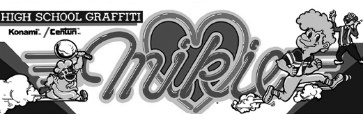</td>
 <td>jtoutrun - Outrun 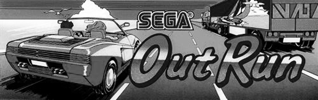</td>
 <td>jtpinpon - Konami's Ping Pong 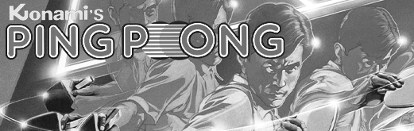</td>
</tr>
<tr>
 <td>jtroadf - Road Fighter </td>
 <td>jtroc - Roc'n Rope 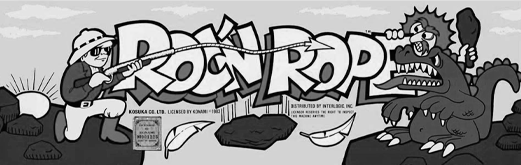</td>
 <td>jtsbaskt - Super Basketball </td>
</tr>
<tr>
 <td>jttrack - Track & Field </td>
 <td>jtvigil - Vigilante 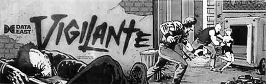</td>
 <td>jtyiear - Yie Ar Kung-Fu 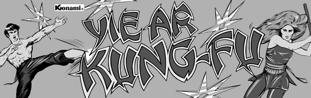</td>
</tr>
<tr><th colspan="3"><a href="https://patreon.com/jotego">Jotego</a> Multi Game Arcade Cores</th></tr>
<tr>
 <td>jtcps1 - Capcom CPS-1 System </td>
 <td>jtpang - Capcom Mitchell Board 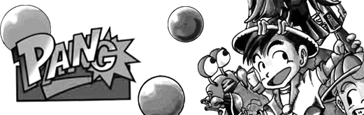</td>
 <td>jtkiwi - Taito NewZealand Board </td>
</tr>
<tr><th colspan="3"><a href="https://patreon.com/nullobject">nullobject</a> Multi Game Arcade Cores</th></tr>
<tr>
 <td>tecmo - Tecmo Rygar Board 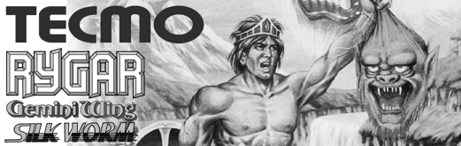</td>
</tr>
<tr><th colspan="3"><a href="https://github.com/psomashekar">Pram0d</a> Single Game Arcade Cores</th></tr>
<tr>
 <td>bakraid - Battle Bakraid </td>
 <td>batrider - Armed Police Batrider </td> 
 <td>garegga - Battle Garegga 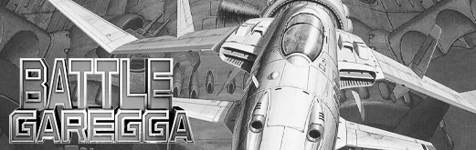</td>
</tr>
<tr>
 <td>kingdmgp - Kingdom Gran Prix </td>
 <td>sstriker - Sorcerer Striker 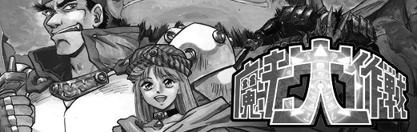</td>
 <td>snowbros2 - Snow Bros 2 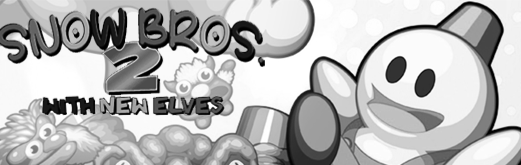</td>
</tr>
<tr><th colspan="3"><a href="https://github.com/agg23">agg23</a> Single Game Arcade Cores</th></tr>
<tr>
 <td>pong - Atari Pong 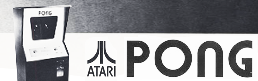</td>
</tr>
</table>

## Platform Overrides for Unreleased* Cores

* unreleased as of the commit date of this file.

<table>
<tr><th colspan="3"><a href="https://patreon.com/jotego">Jotego</a> Single Game Arcade Cores</th></tr>
<tr>
 <td>jt1942 - 1942 </td>
 <td>jt1943 - 1943 </td>
 <td>jtbiocom - Bionic Commando </td>
</tr>
<tr>
 <td>jtbtiger - Black Tiger </td>
 <td>jtbubl - Bubble Bobble </td>
 <td>jtcommnd - Commando </td>
</tr>
<tr>
 <td>jtcomsc - Combat School </td>
 <td>jtcop - Robocop </td>
 <td>jtexed - Exed Exes </td>
</tr>
<tr>
 <td>jtf1drm - F1 Dream </td>
 <td>jtflane - Fast Lane </td>
 <td>jtgunsmk - Gunsmoke </td>
</tr>
<tr>
 <td>jthige - Pirate Ship Higemaru  </td>
 <td>jtkchamp - Karate Champ </td>
 <td>jtktiger - Twin Cobra </td>
</tr>
<tr>
 <td>jtlabrun - Labyrinth Runner </td>
 <td>jtmidres - Midnight Resistance </td>
 <td>jtmx5k - Flak Attack </td>
</tr>
<tr>
 <td>jtninja - Bad Dudes </td>
 <td>jtrastan - Rastan </td>
 <td>jtrumble - Speed Rumbler  </td>
</tr>
<tr>
 <td>jtsarms - Hyper Dyne Side Arms  </td>
 <td>jtsectnz - Section Z </td>
 <td>jtsf - Street Fighter </td>
</tr>
<tr>
 <td>jtshanon - Super Hang-On </td>
 <td>jtslyspy - Sly Spy </td>
 <td>jttora - Tiger Road  </td>
</tr>
<tr>
 <td>jttrojan - Trojan </td>
 <td>jtvulgus - Vulgus </td>
</tr>
<tr><th colspan="3"><a href="https://patreon.com/jotego">Jotego</a> Multi Game Arcade Cores</th></tr>
<tr>
 <td>jtcps15 - Capcom CPS-1.5 Sys </td>
 <td>jtcps2 - Capcom CPS-2 System </td>
</tr>
<tr>
 <td>jts16 - Sega System 16A </td>
 <td>jts16b - Sega System 16B </td>
</tr>
<tr><th colspan="3"><a href="https://patreon.com/nullobject">nullobject</a> Multi Game Arcade Cores</th></tr>
<tr>
 <td>cave - Cave 68000 </td>
</tr>
