# Alternative (or old) Overrides

These are overrides that were either used before or made as an alternative to what I have in my main release.  These overrides will not be included in the release and must be downloaded manually.

<table>
<tr><th colspan="3"><a href="https://patreon.com/jotego">Jotego</a> Multi Game Arcade Cores</th></tr>
<tr>
 <td>jttmnt_c - Konami Turtles (*Combined) </td>
 <td></td>
 <td></td>
</tr>
<tr><th colspan="3"><a href="https://patreon.com/jotego">Jotego</a> Single Game Arcade Cores</th></tr>
<tr>
 <td>jtaliens - Aliens </td> 
 <td>jtdd - Double Double 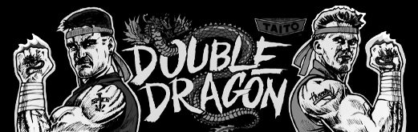</td> 
 <td>jtkarnov - Chelnov Atomic Runner 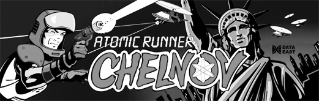</td>
</tr>
<tr>
 <td>jtkunio - Renegade </td>
 <td>jtpang - Pang </td>
 <td>jtkiwi1 - Insector X 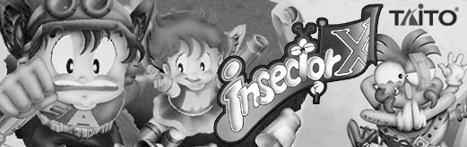</td>
</tr>
<tr>
 <td>jtkiwi - Taito New Zealand </td>
 <td>jtblock - Block Block* </td>
 <td>jtfround - The Final Round </td>
</tr>
<tr>
 <td>jtvulgus - Vulgus </td>
 <td>jtf1drm - F1 Dream </td>
 <td>jthige - Pirate Ship Higemaru </td>
</tr>
<tr>
 <td>jtsf - Street Fighter 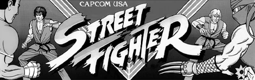</td>
 <td>jtsectnz - Section Z </td>
 <td>bankpanic - Bank Panic </td>
</tr>
<tr>
 <td>jtvigil - Vigilante </td>
 <td>jtdd2 - Double Dragon 2 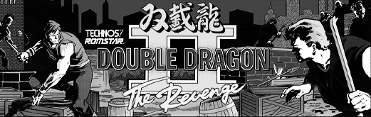</td>
 <td>exerion - Exerion 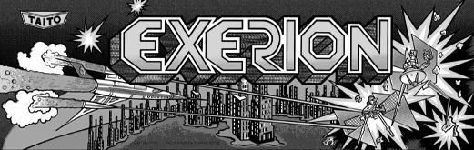</td> 
</tr>
<tr>
 <td>digdug - Dig Dug </td>
 <td>jtbubl - Bubble Bobble 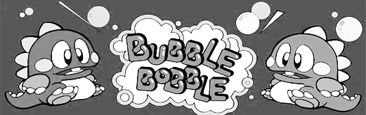</td>
 <td>jtrastan - Rastan </td>
</tr>
<tr>
 <td>jtgunsmk - Gun.Smoke </td>
</tr>
</table>

* TMNT Combines both TMNT and Simpsons into a Single core, but the video resolutions don't match, so it's not perfect :(
* Block Block is a custom core that copies JTpang to play Block Block. BB works on the normal JTpang core now, so it's not necessary.

## Previous Version of Home Core Images

Starting with Release v3.0, I changed the style of my home imagery. These were all the images I used to use. Also included are images in the same style for unreleased cores that I made in preparation.

You can still use them if you'd like. :)

All of these images are collected in the following zip file for easy download: <a href="pocket-platform-overrides-home-v2_archived.zip">pocket-platform-overrides-home-v2_archived.zip</a>

<table>
<tr><th colspan="3">Console Cores</th></tr>
<tr>
 <td>snes - Super Nintendo </td>
 <td>nes - Nintendo NES </td>
 <td>ng - SNK Neo Geo </td>
</tr>
<tr>
 <td>genesis - Sega Genesis </td>
 <td>sms - Master System </td>
 <td>sg1000 - Sega SG-1000 </td>
</tr>
<tr>
 <td>pce - Turbo Grafx 16 </td>
 <td>pcecd - Turbo Grafx CD </td>
 <td>coleco - Colecovision </td>
</tr>
<tr>
 <td>7800 - Atari 7800 </td>
 <td>5200 - Atari 5200 </td>
 <td>2600 - Atari 2600 </td>
</tr>
<tr>
 <td>intv - Intellivision </td>
 <td>odyssey2 - Odyssey 2 </td>
 <td>channel_f - Channel-F </td>
</tr>
<tr>
 <td>arcadia - Arcadia 2001 </td>
 <td>creativision - Creativsion </td>
 <td>studio2 - RCA Studio II </td>
</tr>
<tr>
 <td>vectrex - Vectrex </td> 
</tr>
<tr><th colspan="3">Handheld Cores</th></tr>
<tr>
 <td>gba - GameBoy Advance </td>
 <td>gbc - GameBoy Color </td>
 <td>gb - GameBoy </td>
</tr>
<tr>
 <td>supergb - Super GameBoy </td>
 <td>poke_mini - Pokemon Mini </td>
 <td>gnw - Game & Watch </td>
</tr>
<tr>
 <td>jtngp - Neo Geo Pocket </td>
 <td>ngpc - Neo Geo Pocket Color </td>
 <td>wonderswan - WonderSwan Color </td>
</tr>
<tr>
 <td>gg - Sega GameGear </td>
 <td>sdvmu - Sega Dreamcast VMU </td>
 <td>arduboy - Arduboy </td>
</tr>
<tr>
 <td>lynx - Atari Lynx 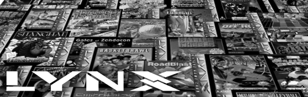</td>
 <td>game_king - GameKing </td>
 <td>supervision - Supervision </td>
</tr>
<tr>
 <td>megaduck - Mega Duck 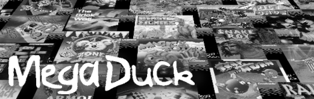</td>
 <td>gamate - Gamate 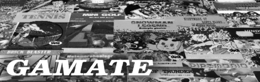</td>
 <td>avision - Adventure Vision </td>
</tr>
<tr><th colspan="3">Computer Cores</th></tr>
<tr>
 <td>amiga - Amiga 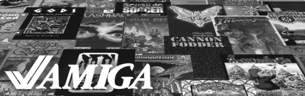</td>
 <td>videobrain - VideoBrain </td>
 <td>rx78 - Bandai RX-78 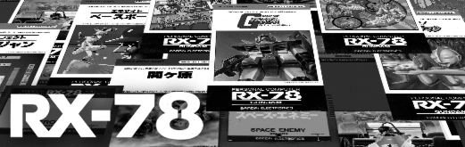</td>
</tr>
</table>

