# Alternative (or old) Overrides

These are overrides that were either used before or made as an alternative to what I have in my main release.  These overrides will not be included in the release and must be downloaded manually.

<table>
<tr><th colspan="3"><a href="https://patreon.com/jotego">Jotego</a> Single Game Arcade Cores</th></tr>
<tr>
 <td>jtkunio - Renegade 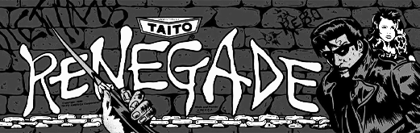</td>
 <td>jtpang - Pang </td>
 <td>jtkiwi - Insector X 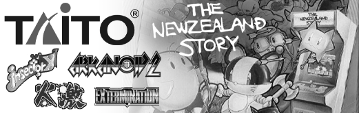</td>
</tr>
<tr><th colspan="3">Console Cores</th></tr>
<tr>
 <td>snes - Super Nintendo 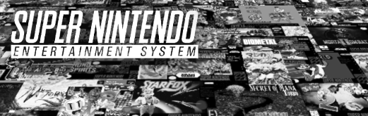</td>
 <td>nes - Nintendo NES </td>
 <td>ng - SNK Neo Geo </td>
</tr>
<tr>
 <td>genesis - Sega Genesis </td>
 <td>sms - Master System 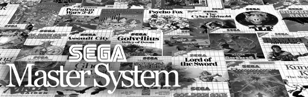</td>
 <td>sg1000 - Sega SG-1000 </td>
</tr>
<tr>
 <td>pce - Turbo Grafx 16 </td>
 <td>coleco - Colecovision 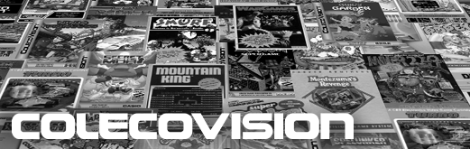</td>
 <td>intv - Intellivision </td>
</tr>
<tr>
 <td>7800 - Atari 7800 </td>
 <td>5200 - Atari 5200 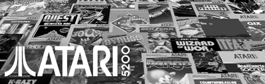</td>
 <td>2600 - Atari 2600 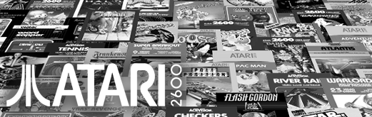</td>
</tr>
<tr>
 <td>odyssey2 - Odyssey 2 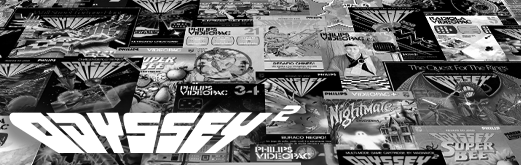</td>
 <td>channel_f - Channel-F 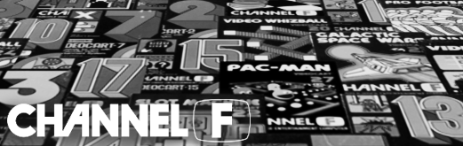</td>
 <td>arcadia - Arcadia 2001 </td>
</tr>
<tr>
 <td>studio2 - RCA Studio II 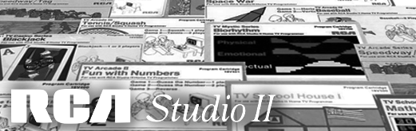</td>
</tr>
<tr><th colspan="3">Handheld Cores</th></tr>
<tr>
 <td>gba - GameBoy Advance </td>
 <td>gbc - GameBoy Color 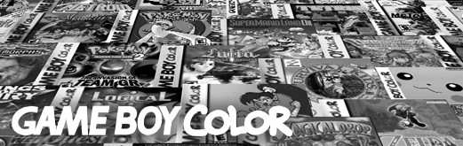</td>
 <td>gb - GameBoy </td>
</tr>
<tr>
 <td>supergb - Super GameBoy 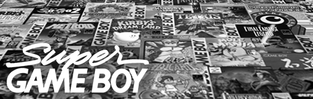</td>
 <td>poke_mini - Pokemon Mini 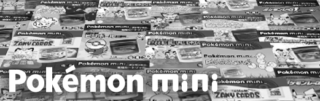</td>
 <td>gg - Sega GameGear 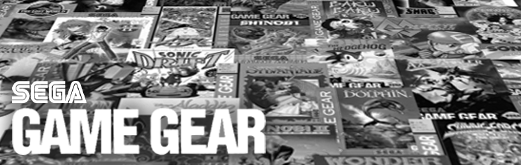</td>
</tr>
<tr>
 <td>arduboy - Arduboy 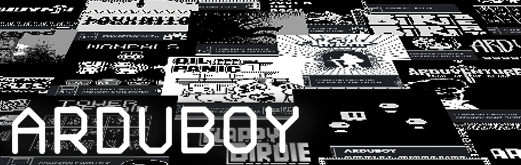</td>
 <td>game_king - GameKing </td>
 <td>supervision - Supervision </td>
</tr>
<tr>
 <td>megaduck - Mega Duck</td>
 <td>gamate - Gamate</td>
 <td>avision - Adventure Vision</td>
</tr>
<tr>
 <td>ngpc - NeoGeo Pocket Color</td>
 <td>ngp - NeoGeo Pocket</td>
 <td>lynx - Atari Lynx</td>
</tr>
<tr>
 <td>WonderSwan Color</td>
 <td>WonderSwan</td>
</tr>
<tr>
</tr>
<tr><th colspan="3">Computer Cores</th></tr>
<tr>
 <td>Amiga</td>
</tr>
<tr>
 <td>VideoBrain</td>
 <td>Creativsion</td>
 <td>pdp1 - PDP-1 Spacewar 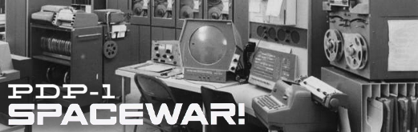</td>
</tr>
</table>

