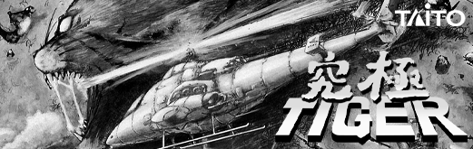
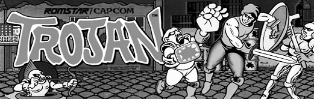
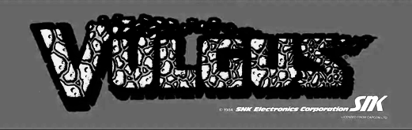
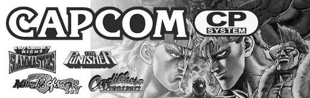
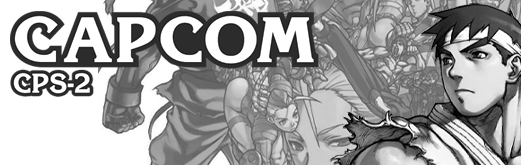
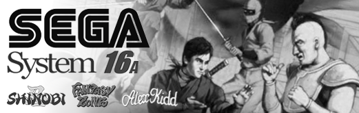
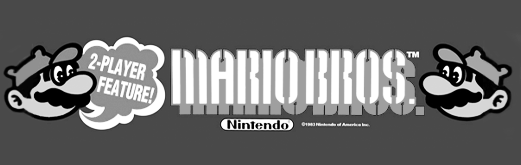
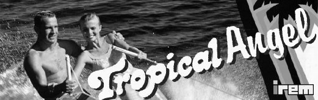
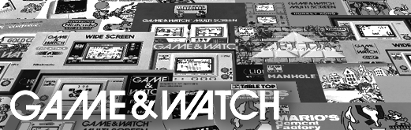

## Platform Overrides for Unreleased* Cores

These are platform overrides for cores that haven't been released yet. These cores are either being actively worked on, or wishful thinking on my part. As these cores are released, I will move them into a new release. You can download all of them now if you wanted to avoid re-downloading them in the future.

- Advisory: As mentioned earlier, if you have too many JSON files in your Platforms folder, it can cause some problems. At one point, I had 300 files in there and things were breaking. 100 files is okay. Probably 200, too. But, the more you have, the slightly slower it can take for the menu to load in.

## Unreleased Arcade Core Overrides

<table>
<tr><th colspan="3"><a href="https://patreon.com/jotego">Jotego</a> Single Game Arcade Cores</th></tr>
<tr>
 <td>jt1942 - 1942 </td>
 <td>jt1943 - 1943 </td>
 <td>jtbiocom - Bionic Commando </td>
</tr>
<tr>
 <td>jtbtiger - Black Tiger </td>
 <td>jtbubl - Bubble Bobble </td>
 <td>jtcommnd - Commando </td>
</tr>
<tr>
 <td>jtcomsc - Combat School </td>
 <td>jtcop - Robocop </td>
 <td>jtexed - Exed Exes </td>
</tr>
<tr>
 <td>jtf1drm - F1 Dream </td>
 <td>jtflane - Fast Lane </td>
 <td>jtgunsmk - Gunsmoke </td>
</tr>
<tr>
 <td>jthige - Pirate Ship Higemaru  </td>
 <td>jtkarnov - Chelnov Atomic Runner </td>
 <td>jtkchamp - Karate Champ </td>
</tr>
<tr>
 <td>jtktiger - Twin Cobra </td>
 <td>jtlabrun - Labyrinth Runner </td>
 <td>jtmidres - Midnight Resistance </td>
</tr>
<tr>
 <td>jtmx5k - Flak Attack </td>
 <td>jtninja - Bad Dudes </td>
 <td>jtrastan - Rastan </td>
</tr>
<tr>
 <td>jtrumble - Speed Rumbler  </td>
 <td>jtsarms - Hyper Dyne Side Arms  </td>
 <td>jtsectnz - Section Z </td>
</tr>
<tr>
 <td>jtsf - Street Fighter </td>
 <td>jtshanon - Super Hang-On </td>
 <td>jtslyspy - Sly Spy </td>
</tr>
<tr>
 <td>jttora - Tiger Road  </td>
 <td>jttrojan - Trojan </td>
 <td>jtvulgus - Vulgus </td>
</tr>
<tr><th colspan="3"><a href="https://patreon.com/jotego">Jotego</a> Multi Game Arcade Cores</th></tr>
<tr>
 <td>jtcps15 - Capcom CPS-1.5 Sys </td>
 <td>jtcps2 - Capcom CPS-2 System </td>
</tr>
<tr>
 <td>jts16 - Sega System 16A </td>
 <td>jts16b - Sega System 16B </td>
</tr>
<tr><th colspan="3"><a href="https://patreon.com/nullobject">nullobject</a> Multi Game Arcade Cores</th></tr>
<tr>
 <td>cave - Cave 68000 </td>
</tr>
<tr><th colspan="3"><a href="https://github.com/opengateware">OpenGateware</a> Single Game Arcade Cores</th></tr>
<tr>
 <td>ataritetris - Atari Tetris  </td>
 <td>bombjack - Bomb Jack </td>
 <td>burgertime - Burger Time </td>
</tr>
<tr>
 <td>burningrubber - Burnin' Rubber </td> 
 <td>crazyballoon - Crazy Balloon  </td>
 <td>crazykong - Crazy Kong  </td>
</tr>
<tr>
 <td>donkeykongjunior - Donkey Kong Jr.  </td>
 <td>donkeykong3 - Donkey Kong 3 </td>
 <td>gaplus - Gaplus </td>
</tr>
<tr>
 <td>mariobros - Mario Bros </td>
 <td>moonpatrol - Moon Patrol </td>
 <td>ninjakun - Ninja-Kun </td>
</tr>
<tr>
 <td>popeye - Popeye </td>
 <td>rallyx - Rally-X </td>
 <td>traverseusa - Motorace USA </td>
</tr>
<tr>
 <td>tropicalangel - Tropical Angel </td> 
 <td>zaxxon - Zaxxon </td>
</tr>
</table>

## Unreleased Home Core Overrides

<table>
<tr><th colspan="3">Handheld Cores</th></tr>
<tr>
 <td>gnw - Game & Watch </td>
 <td>ngpc - NeoGeo Pocket Color </td>
 <td>lynx - Atari Lynx </td>
</tr>
<tr>
 <td>sdvmu - Dreamcast VMU </td>
</tr>
<tr><th colspan="3">Console Cores</th></tr>
<tr>
 <td>vectrex - Vertrex </td>
</tr>
</table>