## Platform Overrides for Unreleased* Cores

These are platform overrides for cores that haven't been released yet. These cores are either being actively worked on, or wishful thinking on my part. As these cores are released, I will move them into a new release. You can download all of them now if you wanted to avoid re-downloading them in the future.

- Advisory: As mentioned earlier, if you have too many JSON files in your Platforms folder, it can cause some problems. At one point, I had 300 files in there and things were breaking. 100 files is okay. Probably 200, too. But, the more you have, the slightly slower it can take for the menu to load in.
- Also, cores often get renamed in development, so the filenames may not match in the future.

## Unreleased Arcade Core Overrides

<table>
<tr><th colspan="3"> Capcom Arcade Cores</th></tr>
<tr>
 <td>Son Son 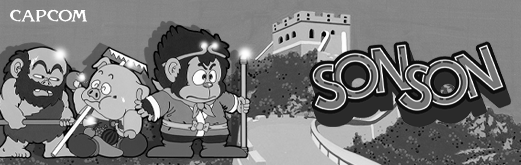</td>
 <td>Speed Rumbler (by <a href="https://patreon.com/jotego">Jotego</a>)  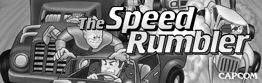</td>
</tr>
<tr><th colspan="3"> Konami Arcade Cores</th></tr>
<tr>
 <td>Finalizer 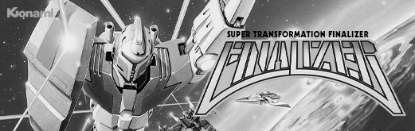</td>
 <td>Gyruss 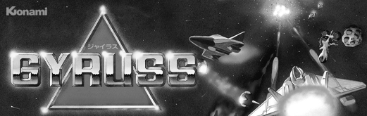</td> 
 <td>Iron Horse 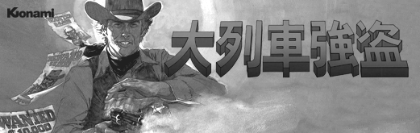</td>
</tr>
<tr>
 <td>Jackal 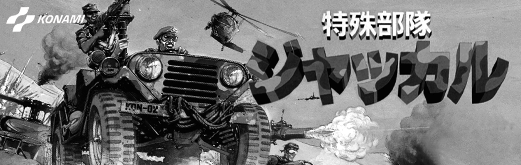</td>
 <td>Labyrinth Runner (by <a href="https://patreon.com/jotego">Jotego</a>) 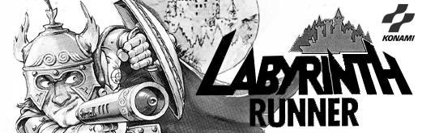</td>
 <td>Scramble 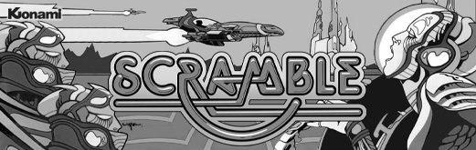</td>
</tr>
<tr>
 <td>Time Pilot 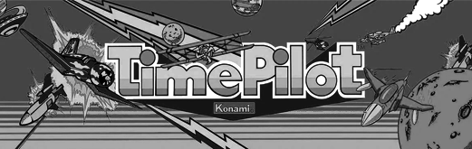</td>
 <td>Time Pilot '84 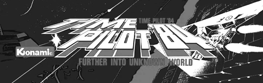</td>
</tr>
<tr><th colspan="3"> Sega Arcade Cores</th></tr>
<tr>
 <td>Sega System 1 & 2 (by <a href="https://github.com/opengateware">OpenGateware</a>) </td>
 <td>Pengo 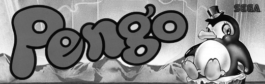</td>
 <td>Zaxxon (by <a href="https://github.com/opengateware">OpenGateware</a>) 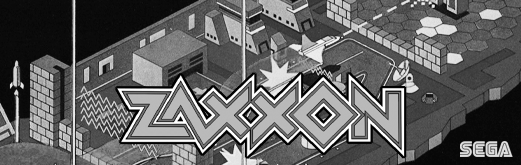</td>
</tr>
<tr><th colspan="3"> Namco Arcade Cores</th></tr>
<tr>
 <td>Namco Super Pacman (by <a href="https://github.com/opengateware">OpenGateware</a>) </td>
 <td>Galaxian (by <a href="https://github.com/opengateware">OpenGateware</a>) 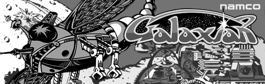</td> 
 <td>Pac-Man / Ms. Pac-Man (<a href="https://github.com/opengateware">OpenGateware</a>) 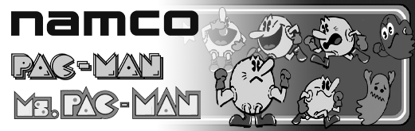</td> 
</tr>
<tr>
 <td>Rally-X (by <a href="https://github.com/opengateware">OpenGateware</a>) 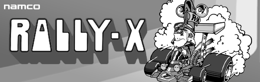</td>
 <td>Bosconian 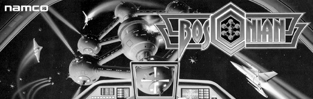</td>
</tr>
<tr><th colspan="3"> Data East Arcade Cores</th></tr>
<tr>
 <td>Lock 'n Chase (Unreleased) 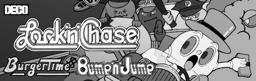</td>
 <td>Midnight Resistance (by <a href="https://patreon.com/jotego">Jotego</a>) 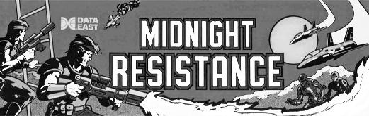</td>
</tr>
<tr><th colspan="3"> Nichibutsu Arcade Cores</th></tr>
<tr>
 <td>Amatelas (by <a href="https://patreon.com/atrac17">Coin-Op</a>) 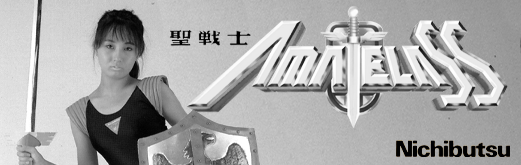</td>
 <td>Armed Formation F (by <a href="https://patreon.com/atrac17">Coin-Op</a>) 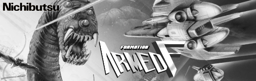</td>
 <td>Tatekae! Big Fighter (by <a href="https://patreon.com/atrac17">Coin-Op</a>) 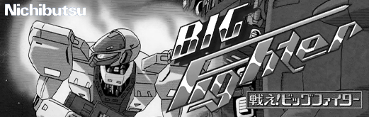</td>
</tr>
<tr>
 <td>Cosmo Police Galivan (by <a href="https://github.com/opengateware">OpenGateware</a>) 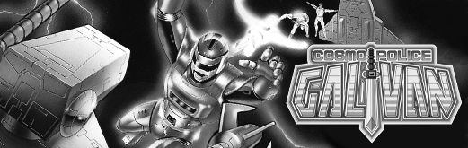</td>
 <td>Crazy Climber 2 (by <a href="https://patreon.com/atrac17">Coin-Op</a>) 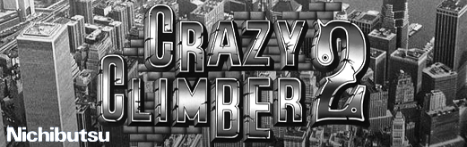</td>
 <td>Kid no Hore Hore Daisakusen (<a href="https://patreon.com/atrac17">Coin-Op</a>) 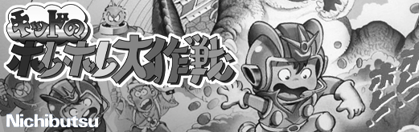</td>
</tr>
<tr>
 <td>Lone Wolf & Club (by <a href="https://patreon.com/atrac17">Coin-Op</a>) 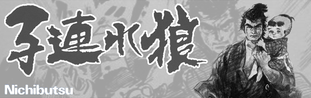</td>
 <td>Chouji Meikyuu Legion (by <a href="https://patreon.com/atrac17">Coin-Op</a>) 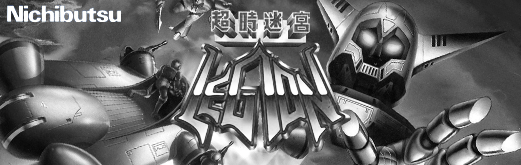</td>
 <td>Terra Cresta (by <a href="https://patreon.com/atrac17">Coin-Op</a>) 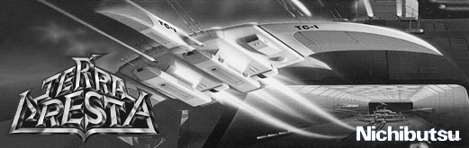</td> 
</tr>
<tr>
 <td>Terra Force (by <a href="https://patreon.com/atrac17">Coin-Op</a>) 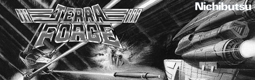</td>
</tr>
<tr><th colspan="3"> SNK Arcade Cores</th></tr>
<tr>
 <td>Gang Wars (by <a href="https://patreon.com/atrac17">Coin-Op</a>) 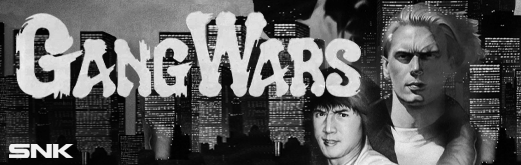</td>
 <td>Ikari Warriors 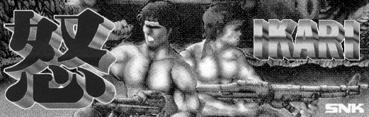</td>
 <td>Ikari 3 The Rescue (by <a href="https://patreon.com/atrac17">Coin-Op</a>) 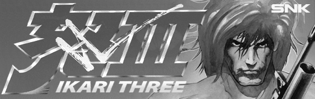</td>
</tr>
<tr>
 <td>The Next Space (by <a href="https://patreon.com/atrac17">Coin-Op</a>) 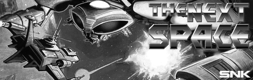</td>
 <td>Paddle Mania (by <a href="https://patreon.com/atrac17">Coin-Op</a>) 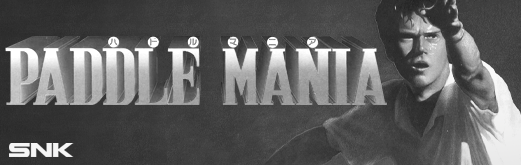</td>
 <td>Prisoners of War (by <a href="https://patreon.com/atrac17">Coin-Op</a>) 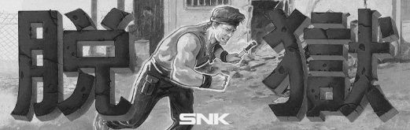</td>
</tr>
<tr>
 <td>Prehistoric Isle (by <a href="https://patreon.com/atrac17">Coin-Op</a>) 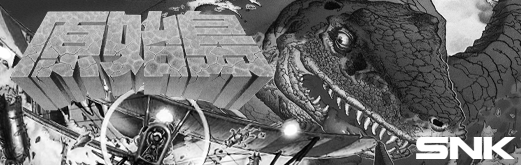</td>
 <td>Super Champion Baseball (by <a href="https://patreon.com/atrac17">Coin-Op</a>) 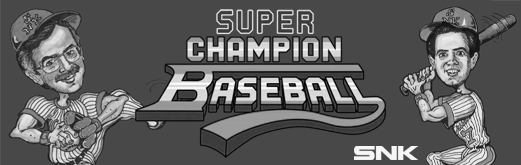</td>
 <td>Search and Rescue (by <a href="https://patreon.com/atrac17">Coin-Op</a>) 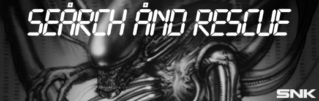</td>
</tr>
<tr>
 <td>Sky Adventures (by <a href="https://patreon.com/atrac17">Coin-Op</a>) 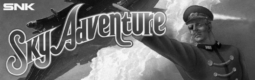</td>
 <td>Sky Soldiers (by <a href="https://patreon.com/atrac17">Coin-Op</a>) 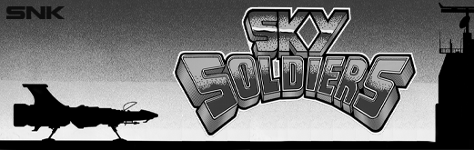</td>
 <td>Street Smart (by <a href="https://patreon.com/atrac17">Coin-Op</a>) 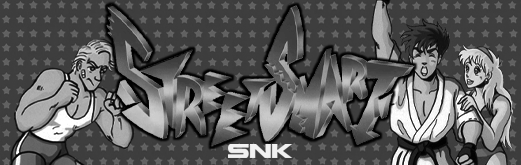</td>
</tr>
<tr>
 <td>Time Soldiers / Battle Field (by <a href="https://patreon.com/atrac17">Coin-Op</a>) 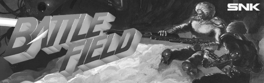</td>
 <td>TNK III 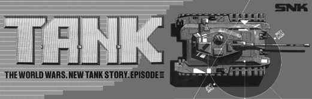</td>
</tr>
<tr><th colspan="3"> Jaleco Arcade Cores</th></tr>
<tr>
 <td>Mega System 1 (Combo*) (unreleased) </td>
 <td>Astyanax / The Lord of King (by <a href="https://patreon.com/atrac17">Coin-Op</a>) 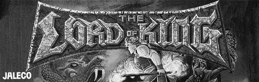</td>
 <td>Chameleon 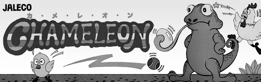</td>
</tr>
<tr>
 <td>Earth Defense Force (by <a href="https://patreon.com/atrac17">Coin-Op</a>) 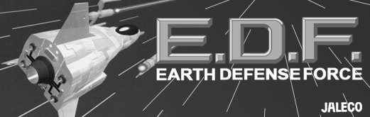</td>
 <td>Hachoo (by <a href="https://patreon.com/atrac17">Coin-Op</a>) 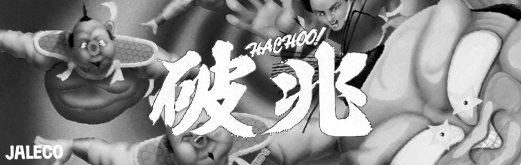</td> 
 <td>In Your Face (by <a href="https://patreon.com/atrac17">Coin-Op</a>) 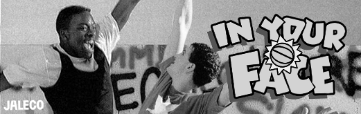</td>
</tr>
<tr>
 <td>Jitsuryoku! Pro Baseball (by <a href="https://patreon.com/atrac17">Coin-Op</a>) </td>
 <td>Ninja Kazan / Iga Ninjyutsuden (<a href="https://patreon.com/atrac17">Coin-Op</a>) 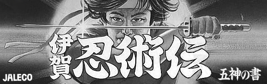</td>
 <td>P47 The Freedom Fighter (by <a href="https://patreon.com/atrac17">Coin-Op</a>) 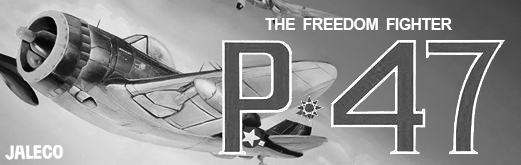</td>
</tr>
<tr>
 <td>Phantasm Avenging Spirit (by <a href="https://patreon.com/atrac17">Coin-Op</a>) 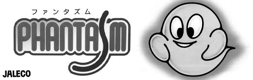</td>
 <td>Plus Alpha (by <a href="https://patreon.com/atrac17">Coin-Op</a>) </td>
 <td>Psychic 5 </td>
</tr>
<tr>
 <td>Rodland (by <a href="https://patreon.com/atrac17">Coin-Op</a>) </td> 
 <td>Soldam (by <a href="https://patreon.com/atrac17">Coin-Op</a>) </td>
 <td>Saint Dragon (by <a href="https://patreon.com/atrac17">Coin-Op</a>) </td>
</tr>
<tr><th colspan="3"> Toaplan Arcade Cores</th></tr>
<tr>
 <td>Toaplan Version 1 (Combo*) </td>
 <td>Demon's World (by <a href="https://patreon.com/atrac17">Coin-Op</a>) </td>
 <td>Flying Shark (by <a href="https://patreon.com/atrac17">Coin-Op</a>) </td>
</tr>
<tr>
 <td>Ghox </td>
 <td>Hellfire (by <a href="https://patreon.com/atrac17">Coin-Op</a>) </td>
 <td>Out Zone (by <a href="https://patreon.com/atrac17">Coin-Op</a>) </td>
</tr>
<tr>
 <td>Rally Bike (by <a href="https://patreon.com/atrac17">Coin-Op</a>) </td>
 <td>Same! Same! Same! (by <a href="https://patreon.com/atrac17">Coin-Op</a>) </td>
 <td>Snow Bros. (by <a href="https://patreon.com/atrac17">Coin-Op</a>) </td>
</tr>
<tr>
 <td>Truxton (by <a href="https://patreon.com/atrac17">Coin-Op</a>) </td>
 <td>Twin Cobra (by <a href="https://patreon.com/atrac17">Coin-Op</a>) </td>
 <td>Vimana (by <a href="https://patreon.com/atrac17">Coin-Op</a>) </td>
</tr>
<tr>
 <td>Wardner (by <a href="https://patreon.com/atrac17">Coin-Op</a>) </td> 
 <td>Zero Wing (by <a href="https://patreon.com/atrac17">Coin-Op</a>) </td>
</tr>
<tr><th colspan="3">Irem Arcade cores</th></tr>
<tr>
 <td>Irem M72 Board (by <a href="https://github.com/opengateware">OpenGateware</a>)  </td>
 <td>Irem M62 Board (by <a href="https://github.com/opengateware">OpenGateware</a>)  </td>
 <td>Irem M50 Series (by <a href="https://github.com/opengateware">OpenGateware</a>)  </td>
</tr>
<tr><th colspan="3">Bally Midway Arcade cores</th></tr>
<tr>
 <td>Bally Midway MCR (Combo) (<a href="https://github.com/opengateware">OpenGateware</a>)  </td>
 <td>Bally Midway MCR-3 (by <a href="https://github.com/opengateware">OpenGateware</a>)  </td>
 <td>Bally Midway MCR-3 (by <a href="https://github.com/opengateware">OpenGateware</a>)  </td>
</tr>
<tr>
 <td>Bally Midway MCR-1 (by <a href="https://github.com/opengateware">OpenGateware</a>)  </td>
 <td>Bally Midway MCR-2 (by <a href="https://github.com/opengateware">OpenGateware</a>)  </td>
 <td>Bally Midway MCR-3  (by <a href="https://github.com/opengateware">OpenGateware</a>) </td>
</tr>
<tr><th colspan="3"> Nintendo Arcade Cores</th></tr>
<tr>
 <td>Popeye (by <a href="https://github.com/opengateware">OpenGateware</a>) </td>
</tr>
<tr><th colspan="3"> Atari Arcade Cores</th></tr>
<tr>
 <td>Atari Tetris (by <a href="https://github.com/opengateware">OpenGateware</a>) </td>
</tr>
<tr><th colspan="3"> Taito Arcade Cores</th></tr>
<tr>
 <td>Arkanoid </td>
 <td>Crazy Balloon (by <a href="https://github.com/opengateware">OpenGateware</a>)  </td>
</tr>
<tr><th colspan="3">Technos Japan Cores</th></tr>
<tr>
 <td>Combatribes </td>
</tr>
<tr><th colspan="3"> Other Arcade Cores</th></tr>
<tr>
 <td>Exidy UGB 2 (by <a href="https://github.com/antongale">Anton Gale</a>) </td>
 <td>Cave 68000 (by <a href="https://www.patreon.com/nullobject/posts">nullobject</a>) </td>
</tr>
<tr>
 <td>Bomb Jack (by <a href="https://github.com/opengateware">OpenGateware</a>) </td>
 <td>Crazy Kong (by <a href="https://github.com/opengateware">OpenGateware</a>) </td>
 <td>Solomon's Key </td>
</tr>
</table>

## Unreleased Home Core Overrides

<table>
<tr><th colspan="3">Handheld Cores</th></tr>
<tr>
 <td>NeoGeo Pocket Color </td>
 <td>Atari Lynx </td>
 <td>Dreamcast VMU </td>
</tr>
<tr>
 <td>Virtual Boy </td>
 <td>Tiger Game.Com </td>
 <td>Nokia N-Gage </td>  
</tr>
<tr><th colspan="3">Consoles Cores</th></tr>
<tr>
 <td>Sega 32x </td>
 <td>Super 32x (JP) </td>
 <td>Mega Drive 32x (PAL) </td>
</tr>
<tr>
 <td>segapico - Sega Pico </td>
</tr>
<tr><th colspan="3">Computer Cores</th></tr>
<tr>
 <td>ZX Spectrum </td>
 <td>Apple II </td>
 <td>MSX </td>
</tr>
<tr>
 <td>Sharp X68000 </td>
 <td>NEC PC-8801 </td>
 <td>Bandai RX-78 </td>
</tr>
<tr><th colspan="3">Other Cores</th></tr>
<tr>
 <td>MP3 Player </td>
</tr>
</table>