## Platform Overrides for Unreleased* Cores

These are platform overrides for cores that haven't been released yet. These cores are either being actively worked on, or wishful thinking on my part. As these cores are released, I will move them into a new release. You can download all of them now if you wanted to avoid re-downloading them in the future.

- Advisory: As mentioned earlier, if you have too many JSON files in your Platforms folder, it can cause some problems. At one point, I had 300 files in there and things were breaking. 100 files is okay. Probably 200, too. But, the more you have, the slightly slower it can take for the menu to load in.

## Unreleased Arcade Core Overrides

<table>
<tr><th colspan="3"><a href="https://patreon.com/jotego">Jotego</a> Single Game Arcade Cores</th></tr>
<tr>
 <td>jt1943 - 1943 </td>
 <td>jtbiocom - Bionic Commando 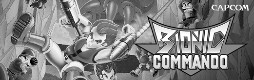</td>
 <td>jtcommnd - Commando 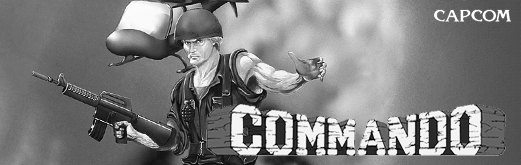</td>
</tr>
<tr>
 <td>jtflane - Fast Lane 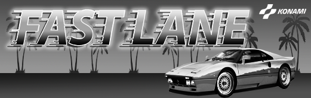</td>
 <td>jtkchamp - Karate Champ 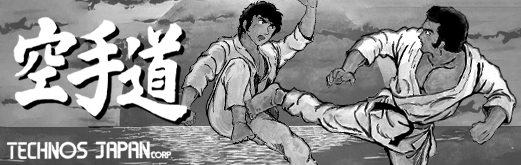</td>
 <td>jtlabrun - Labyrinth Runner </td>
</tr>
<tr>
 <td>jtmidres - Midnight Resistance </td>
 <td>jtmx5k - Flak Attack 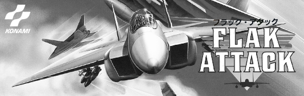</td>
 <td>jtrumble - Speed Rumbler  </td>
</tr>
<tr>
 <td>jtslyspy - Sly Spy </td>
</tr>
<tr><th colspan="3"><a href="https://github.com/opengateware">OpenGateware</a> Single Game Arcade Cores</th></tr>
<tr>
 <td>ataritetris - Atari Tetris  </td>
 <td>bombjack - Bomb Jack </td>
 <td>burgertime - Burger Time 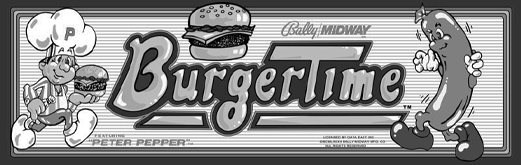</td>
</tr>
<tr>
 <td>burningrubber - Burnin' Rubber </td> 
 <td>crazyballoon - Crazy Balloon  </td>
 <td>crazykong - Crazy Kong  </td>
</tr>
<tr>
 <td>galaxian - Galaxian </td> 
 <td>galivan - Cosmo Police Galivan </td>
 <td>gaplus - Gaplus 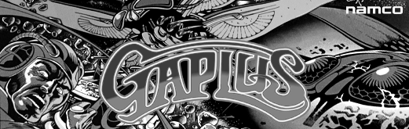</td>
</tr>
<tr>
 <td>ninjakun - Ninja-Kun 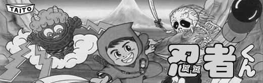</td>
 <td>pacman - Pac-Man / Ms. Pac-Man </td> 
 <td>popeye - Popeye </td>
</tr>
<tr>
 <td>rallyx - Rally-X </td>
 <td>zaxxon - Zaxxon </td>
</tr>
<tr><th colspan="3"><a href="https://patreon.com/atrac17">CoinOpCollection</a> Single Game Arcade Cores</th></tr>
<tr>
 <td>gangways - Gang Wars </td>
 <td>ikari3 - Ikari 3 The Rescue </td>
 <td>nextspace - The Next Space </td>
</tr>
<tr>
 <td>paddlema - Paddle Mania </td>
 <td>pow - Prisoners of War </td>
 <td>prehisle - Prehistoric Isle </td>
</tr>
<tr>
 <td>sbaseball - Super Champion Baseball </td>
 <td>searchar - Search and Rescue </td>
 <td>skyadvnt - Sky Adventures </td>
</tr>
<tr> 
 <td>skysoldr - Sky Soldiers </td>
 <td>streetsm - Street Smart </td>
 <td>timesold - Time Soldiers / Battle Field </td>
</tr>
<tr>
 <td>amatelas - Amatelas </td>
 <td>armedf - Armed Formation F </td>
 <td>bigfghtr - Tatekae! Big Fighter </td>
</tr>
<tr>
 <td>cclimbr2 - Crazy Climber 2 </td>
 <td>horekid - Kid no Hore Hore Daisakusen </td>
 <td>kozure - Lone Wolf & Club </td>
</tr>
<tr>
 <td>legionj - Chouji Meikyuu Legion </td>
 <td>terracresta - Terra Cresta </td> 
 <td>terrafj - Terra Force </td>
</tr>
<tr>
 <td>astyanax - Astyanax / The Lord of King </td>
 <td>edf - Earth Defense Force </td>
 <td>hachoo - Hachoo </td> 
</tr>
<tr>
 <td>inyourface - In Your Face </td>
 <td>jitsupro - Jitsuryoku! Pro Baseball </td>
 <td>kazan - Ninja Kazan / Iga Ninjyutsuden </td>
</tr>
<tr>
 <td>p47 - P47 The Freedom Fighter </td>
 <td>phantasm - Phantasm Avenging Spirit </td>
 <td>plusalpha - Plus Alpha </td>
</tr>
<tr>
 <td>rodland - Rodland </td> 
 <td>soldam - Soldam </td>
 <td>stdragon - Saint Dragon </td>
</tr>
<tr>
 <td>demonwld - Demon's World </td>
 <td>fshark - Flying Shark </td>
 <td>hellfire - Hellfire </td>
</tr>
<tr>
 <td>outzone - Out Zone </td>
 <td>rallybike - Rally Bike </td>
 <td>samesame - Same! Same! Same! </td>
</tr>
<tr>
 <td>snowbros - Snow Bros. </td>
 <td>truxton - Truxton </td>
 <td>twincobr - Twin Cobra </td>
</tr>
<tr>
 <td>vimana - Vimana </td>
 <td>wardner - Wardner </td> 
 <td>zerowing - Zero Wing </td>
</tr>
<tr><th colspan="3"><a href="https://github.com/Ace9921">Ace</a> Single Game Arcade Cores</th></tr>
<tr>
 <td>arkanoid - Arkanoid </td>
 <td>timepilot - Time Pilot </td>
 <td>timepilot84 - Time Pilot '84 </td>
</tr>
<tr>
 <td>finalizer - Finalizer </td>
 <td>gyruss - Gyruss </td> 
 <td>ironhorse - Iron Horse </td>
</tr>
<tr>
 <td>jackal - Jackal </td>
</tr>
<tr><th colspan="3">Other Upcoming Arcade cores</th></tr>
<tr>
 <td>exidyugb2 - Exidy UGB 2 </td>
</tr>
<tr><th colspan="3">Possbile Multi Game Arcade cores from <a href="https://github.com/opengateware">OpenGateware</a></th></tr>
<tr>
 <td>mcr_c - Bally Midway MCR (Combined) </td>
 <td>mcr3scroll - Bally Midway MCR-3 (Scroll) </td>
 <td>mcr3mono - Bally Midway MCR-3 (Mono) </td>
</tr>
<tr>
 <td>mcr1 - Bally Midway MCR-1 </td>
 <td>mcr2 - Bally Midway MCR-2 </td>
 <td>mcr3 - Bally Midway MCR-3 </td>
</tr>
<tr>
 <td>segasys12 - Sega System 1 & 2 </td>
 <td>robotron - Williams 6809 Rev. 1 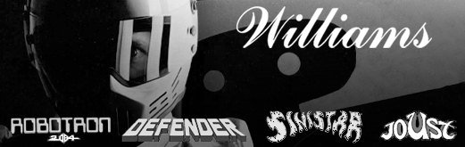</td>
 <td>superpac - Namco Super Pacman Board </td>
</tr>
<tr>
 <td>iremm92 - Item M92 Board 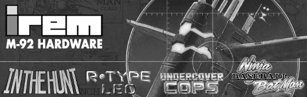</td>
 <td>iremm72 - Irem M72 Board 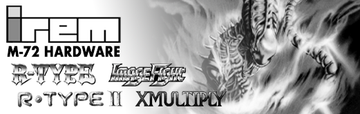</td>
 <td>iremm62 - Irem M62 Board 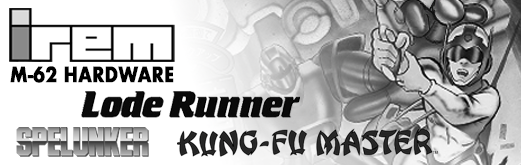</td>
</tr>
<tr>
 <td>iremm5x - Irem M50 Series 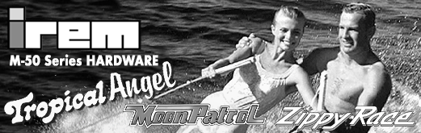</td>
</tr>
<tr><th colspan="3">Unlikely or Impossible Arcade cores</th></tr>
<tr>
 <td>jtcps3 - Capcom CPS-3 System 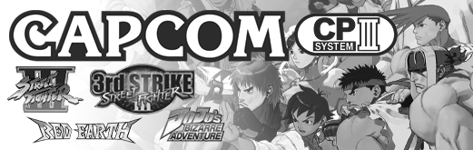</td>
 <td>jtkombat - Midway Y-Unit 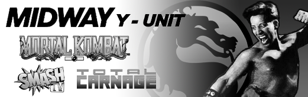</td>
 <td>cave - Cave 68000 </td>
</tr>
</table>

## Unreleased Home Core Overrides

<table>
<tr><th colspan="3">Handheld Cores</th></tr>
<tr>
 <td>ngpc - NeoGeo Pocket Color </td>
 <td>lynx - Atari Lynx </td>
 <td>sdvmu - Dreamcast VMU </td>
</tr>
<tr>
 <td>vb - Virtual Boy </td>
 <td>gamecom - Tiger Game.Com </td>
 <td>ngage - Nokia N-Gage </td>  
</tr>
<tr><th colspan="3">Consoles Cores</th></tr>
<tr>
 <td>segapico - Sega Pico </td>
</tr>
<tr><th colspan="3">Computer Cores</th></tr>
<tr>
 <td>zx - ZX Spectrum </td>
 <td>a2 - Apple II </td>
 <td>msx - MSX </td>
</tr>
<tr>
 <td>x68000 - Sharp X68000 </td>
 <td>pc8801 - NEC PC-8801 </td>
 <td>rx78 - Bandai RX-78 </td>
</tr>
<tr><th colspan="3">Other Cores</th></tr>
<tr>
 <td>MP3 Player </td>
</tr>
</table>