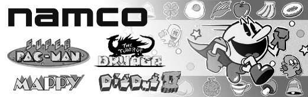
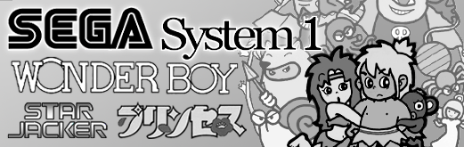
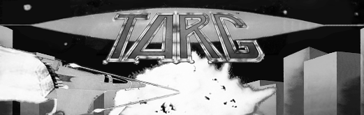
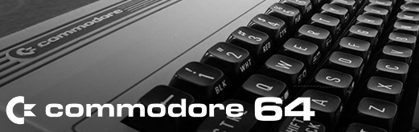

## Platform Overrides for Unreleased* Cores

These are platform overrides for cores that haven't been released yet. These cores are either being actively worked on, or wishful thinking on my part. As these cores are released, I will move them into a new release. You can download all of them now if you wanted to avoid re-downloading them in the future.

- Advisory: As mentioned earlier, if you have too many JSON files in your Platforms folder, it can cause some problems. At one point, I had 300 files in there and things were breaking. 100 files is okay. Probably 200, too. But, the more you have, the slightly slower it can take for the menu to load in.

## Unreleased Arcade Core Overrides

<table>
<tr><th colspan="3"><a href="https://patreon.com/jotego">Jotego</a> Single Game Arcade Cores</th></tr>
<tr>
 <td>jt1942 - 1942 </td>
 <td>jt1943 - 1943 </td>
 <td>jtbiocom - Bionic Commando </td>
</tr>
<tr>
 <td>jtcommnd - Commando </td>
 <td>jtf1drm - F1 Dream </td>
 <td>jtflane - Fast Lane </td>
</tr>
<tr>
 <td>jthige - Pirate Ship Higemaru  </td>
 <td>jtkchamp - Karate Champ </td>
 <td>jtktiger - Twin Cobra </td>
</tr>
<tr>
 <td>jtlabrun - Labyrinth Runner </td>
 <td>jtmidres - Midnight Resistance </td>
 <td>jtmx5k - Flak Attack </td>
</tr>
<tr>
 <td>jtrumble - Speed Rumbler  </td>
 <td>jtslyspy - Sly Spy </td>
</tr>
<tr><th colspan="3"><a href="https://github.com/opengateware">OpenGateware</a> Single Game Arcade Cores</th></tr>
<tr>
 <td>ataritetris - Atari Tetris  </td>
 <td>bombjack - Bomb Jack </td>
 <td>burgertime - Burger Time </td>
</tr>
<tr>
 <td>burningrubber - Burnin' Rubber </td> 
 <td>crazyballoon - Crazy Balloon  </td>
 <td>crazykong - Crazy Kong  </td>
</tr>
<tr>
 <td>donkeykongjunior - Donkey Kong Jr.  </td>
 <td>donkeykong3 - Donkey Kong 3 </td>
 <td>galaxian - Galaxian </td> 
</tr>
<tr>
 <td>galivan - Cosmo Police Galivan </td>
 <td>gaplus - Gaplus </td>
 <td>mariobros - Mario Bros </td>
</tr>
<tr>
 <td>moonpatrol - Moon Patrol </td>
 <td>ninjakun - Ninja-Kun </td>
 <td>popeye - Popeye </td>
</tr>
<tr>
 <td>rallyx - Rally-X </td>
 <td>traverseusa - Motorace USA </td>
 <td>tropicalangel - Tropical Angel </td> 
</tr>
<tr>
 <td>zaxxon - Zaxxon </td>
</tr>
<tr><th colspan="3"><a href="https://patreon.com/atrac17">Atrac17</a> Single Game Arcade Cores</th></tr>
<tr>
 <td>armedf - Armed Formation F </td>
 <td>terracresta - Terra Cresta </td> 
 <td>nextspace - The Next Space </td>
</tr>
<tr>
 <td>prehisle - Prehistoric Isle </td>
 <td>demonwld - Demon's World </td>
 <td>pipibibs - Pipi & Bibs </td>
</tr>
<tr>
 <td>rallybike - Rally Bike </td>
 <td>truxton - Truxton </td>
 <td>vimana - Vimana </td>
</tr>
<tr>
 <td>samesame - Same! Same! Same! </td>
</tr>
<tr><th colspan="3">Possbile Multi Game Arcade cores from <a href="https://patreon.com/jotego">Jotego</a>, <a href="https://patreon.com/nullobject">nullobject</a>, <a href="https://github.com/opengateware">OpenGateware</a>, and others</th></tr>
<tr>
 <td>robotron - Williams 6809 Rev. 1 </td>
 <td>pacman - Namco Pacman Board </td> 
 <td>druaga - Namco Super Pacman Board </td>
</tr>
<tr>
 <td>jtcps3 - Capcom CPS-3 System </td>
 <td>segasys1 - Sega System 1 </td>
 <td>cave - Cave 68000 </td>
</tr>
<tr>
 <td>mcr_c - Bally Midway MCR (Combined) </td>
 <td>mcr3scroll - Bally Midway MCR-3 (Scroll) </td>
 <td>mcr3mono - Bally Midway MCR-3 (Mono) </td>
</tr>
<tr>
 <td>mcr1 - Bally Midway MCR-1 </td>
 <td>mcr2 - Bally Midway MCR-2 </td>
 <td>mcr3 - Bally Midway MCR-3 </td>
</tr>
<tr>
 <td>iremm62 - Irem M62 Board </td>
 <td>iremm72 - Irem M72 Board </td>
 <td>iremm92 - Item M92 Board </td>
</tr>
<tr><th colspan="3">Other Possible Arcade cores</th></tr>
<tr>
 <td>starwars - Star Wars 1983 </td>
 <td>targ - Targ </td>
 <td>jtkombat - Midway Y-Unit </td>
</tr>
</table>

## Unreleased Home Core Overrides

<table>
<tr>
 <th colspan="2">Handheld Cores</th>
 <th>Console Cores</th>
</tr>
<tr>
 <td>ngpc - NeoGeo Pocket Color </td>
 <td>vb - Virtual Boy </td>
 <td>vectrex - Vertrex </td>
</tr>
<tr>
 <td>sdvmu - Dreamcast VMU </td>
 <td>lynx - Atari Lynx </td>
 <td>segapico - Sega Pico </td>
</tr>
<tr>
 <td>gamecom - Tiger Game.Com </td>
 <td>ngage - Nokia N-Gage </td>  
</tr>
<tr><th colspan="3">Computer Cores</th></tr>
<tr>
 <td>c64 - Commodore 64 </td>
 <td>a2 - Apple II </td>
 <td>msx - MSX </td>
</tr>
<tr>
 <td>x68000 - Sharp X68000 </td>
 <td>pc8801 - NEC PC-8801 </td>
 <td>rx78 - Bandai RX-78 </td>
</tr>
</table>