## Platform Overrides for Unreleased* Cores

These are platform overrides for cores that haven't been released yet. These cores are either being actively worked on, or wishful thinking on my part. As these cores are released, I will move them into a new release. You can download all of them now if you wanted to avoid re-downloading them in the future.

- Advisory: As mentioned earlier, if you have too many JSON files in your Platforms folder, it can cause some problems. At one point, I had 300 files in there and things were breaking. 100 files is okay. Probably 200, too. But, the more you have, the slightly slower it can take for the menu to load in.
- Also, cores often get renamed in development, so the filenames may not match in the future.

## Unreleased Arcade Core Overrides

<table>
<tr><th colspan="3"> Capcom Arcade Cores</th></tr>
<tr>
 <td>Capcom CPS-3 System 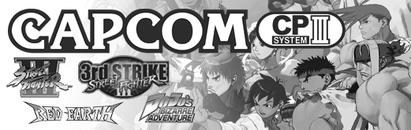</td>
</tr>
<tr><th colspan="3"> Konami Arcade Cores</th></tr>
<tr>
 <td>Time Pilot 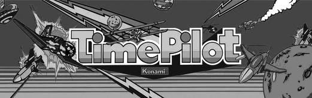</td>
 <td>Time Pilot '84 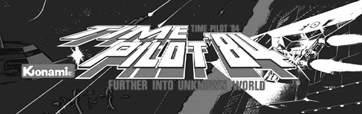</td>
</tr>
<tr><th colspan="3"> Jaleco Arcade Cores</th></tr>
<tr>
 <td>Mega System 1 (Combo*) (unreleased) </td>
</tr>

<tr><th colspan="3"> Other Arcade Cores</th></tr>
<tr>
 <td>Cave 68000 (by <a href="https://www.patreon.com/nullobject/posts">nullobject</a>) 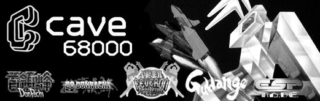</td>
</tr>
</table>

## Unreleased Home Core Overrides

<table>
<tr><th colspan="3">Handheld Cores</th></tr>
<tr>
 <td>Tiger Game.Com 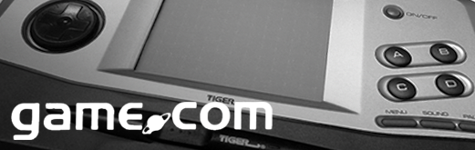</td>
 <td>Nokia N-Gage 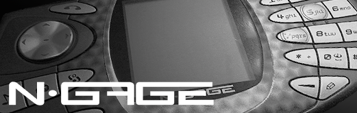</td>  
</tr>
<tr><th colspan="3">Computer Cores</th></tr>
<tr>
 <td>Sharp X68000 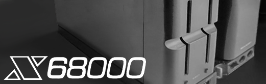</td>
 <td>NEC PC-8801 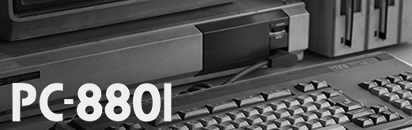</td>
 <td>Bandai RX-78 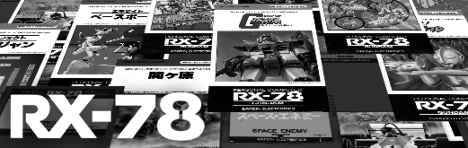</td>
</tr>
<tr><th colspan="3">Other Cores</th></tr>
<tr>
 <td>MP3 Player </td>
 <td>Rom Dumper 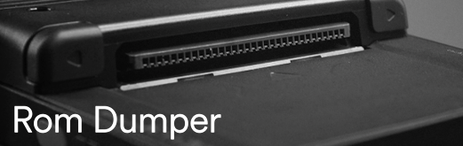</td>
</tr>
<tr><th colspan="3">PC Conversions</th></tr>
<tr>
 <td>Wipeout Rewrite </td>
 <td>Cave Story </td>
 <td>McPixel 3 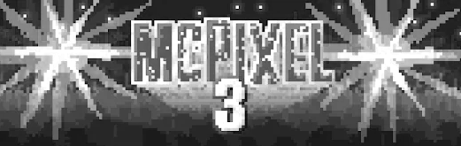</td>
</tr>
<tr>
 <td>Warcraft 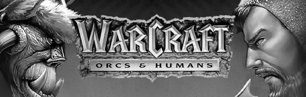</td>
 <td>Warcraft II </td>
 <td>Starcraft 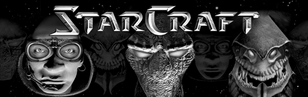</td>
</tr>
</table>