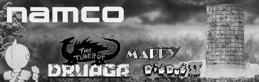
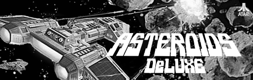
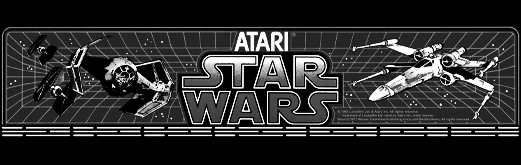
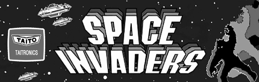
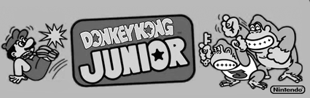
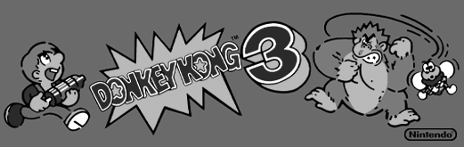
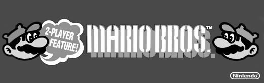

## Platform Overrides for Arcade Cores

Arcade cores are currently split up into two categories: **Arcade** and **Arcade Multi**. 

- If an arcade board supports multiple noteworthy games, then I put into into the **Arcade Multi** category.  All of the Arcade Multi images are follow a particular image format. 

- If an arcade board only supports a single game or a single noteworthy game, then it's in the **Arcade** category, and the image is either the original marquee used in arcades, or an image created from key artwork. 

All artwork used is meant to be official artwork from the time of the game's release. I try to avoid using fanart.

* For the <b>Sega System 16</b> Combined core, please refer to Espiox's repo: <a href="https://github.com/espiox/jts16_complete">/jts16_complete</a>.

* For the <b>Toaplan Version 2</b> Combine core, prefer refer to pocket-extras: <a href="https://github.com/dyreschlock/pocket-extras/tree/main/toaplan2_complete">/pocket-extras/toaplan2</a>

<table>
<tr><th colspan="3"><a href="https://patreon.com/jotego">Jotego</a> Multi Game Arcade Cores</th></tr>
<tr>
 <td>jtcps1 - Capcom CPS-1 System </td>
 <td>jtcps15 - Capcom CPS-1.5 System </td>
 <td>jtcps2 - Capcom CPS-2 System </td>
</tr>
<tr>
 <td>jts16_c - Sega System 16 (Combined*) </td>
 <td>jts16 - Sega System 16A </td>
 <td>jts16b - Sega System 16B </td>
</tr>
<tr>
 <td>jtaliens - Konami Aliens </td> 
 <td>jtkiwi - Taito NewZealand Board </td>
 <td>jtshouse - Namco System I </td>
</tr>
<tr><th colspan="3">Other Multi Game Arcade Cores (from <a href="https://github.com/antongale">Anton Gale</a>, <a href="https://patreon.com/nullobject">nullobject</a>, <a href="https://github.com/Coin-OpCollection">Coin-Op Collection</a>, <a href="https://github.com/obsidian-dot-dev">Obsidian</a>)</th></tr>
<tr>
 <td>taitosj - Taito System SJ </b></td>
 <td>tecmo - Tecmo Rygar Board </b></td>
 <td>toaplan2_c - Toaplan Version 2 (Combo*) </td>
</tr>
<tr>
 <td>druaga - Namco Druaga Board </td>
</tr>
<tr><th colspan="3"> Capcom Single Arcade Games</th></tr>
<tr>
 <td>1942 (by <a href="https://patreon.com/jotego">Jotego</a>) </td>
 <td>Black Tiger (by <a href="https://patreon.com/jotego">Jotego</a>) </td>
 <td>Exed Exes (by <a href="https://patreon.com/jotego">Jotego</a>) </td>
</tr>
<tr>
 <td>Ghosts 'n Goblins (by <a href="https://patreon.com/jotego">Jotego</a>) </td>
 <td>Gun.Smoke (by <a href="https://patreon.com/jotego">Jotego</a>) </td>
 <td>Hyper Dyne Side Arms (by <a href="https://patreon.com/jotego">Jotego</a>)  </td>
</tr>
<tr>
 <td>Pang / Super Pang (by <a href="https://patreon.com/jotego">Jotego</a>) </td>
 <td>Section Z (by <a href="https://patreon.com/jotego">Jotego</a>) </td>
 <td>Street Fighter (by <a href="https://patreon.com/jotego">Jotego</a>) </td>
</tr>
<tr>
 <td>Tiger Road (by <a href="https://patreon.com/jotego">Jotego</a>) </td>
 <td>Trojan (by <a href="https://patreon.com/jotego">Jotego</a>) </td>
</tr>
<tr><th colspan="3"> Konami Single Arcade Games</th></tr>
<tr>
 <td>Contra (by <a href="https://patreon.com/jotego">Jotego</a>) </td>
 <td>Combat School (by <a href="https://patreon.com/jotego">Jotego</a>) </td>
 <td>The Final Round (by <a href="https://patreon.com/jotego">Jotego</a>) </td>
</tr>
<tr>
 <td>Green Beret (by <a href="https://github.com/opengateware">OpenGateware</a>) </td>
 <td>Haunted Castle (by <a href="https://patreon.com/jotego">Jotego</a>) </td>
 <td>Mikie (by <a href="https://patreon.com/jotego">Jotego</a>) </td>
</tr>
<tr>
 <td>Ping Pong (by <a href="https://patreon.com/jotego">Jotego</a>) </td>
 <td>Pooyan (by <a href="https://github.com/opengateware">OpenGateware</a>) </td>
 <td>Road Fighter (by <a href="https://patreon.com/jotego">Jotego</a>) </td>
</tr>
<tr>
 <td>Roc'n Rope (by <a href="https://patreon.com/jotego">Jotego</a>) </td>
 <td>Shao-Lin's Road (by <a href="https://patreon.com/jotego">Jotego</a>) </td>
 <td>The Simpsons (by <a href="https://patreon.com/jotego">Jotego</a>) </td>
</tr>
<tr>
 <td>Super Basketball (by <a href="https://patreon.com/jotego">Jotego</a>) </td>
 <td>Teenage Mutant Ninja Turtles (by <a href="https://patreon.com/jotego">Jotego</a>) </td>
 <td>Track & Field (by <a href="https://patreon.com/jotego">Jotego</a>) </td>
</tr>
<tr>
 <td>Yie Ar Kung-Fu (by <a href="https://patreon.com/jotego">Jotego</a>) </td>
</tr>
<tr><th colspan="3"> Atari Single Arcade Games</th></tr>
<tr>
 <td>Asteroids (by <a href="https://github.com/ericlewis">ericlewis</a>) </td>
 <td>Asteroids Deluxe (by <a href="https://github.com/obsidian-dot-dev">Obsidian</a>) </td>
 <td>Dominos (by <a href="https://github.com/ericlewis">ericlewis</a>) </td>
</tr>
<tr>
 <td>Lunar Lander (by <a href="https://github.com/ericlewis">ericlewis</a>) </td>
 <td>Pong (by <a href="https://github.com/agg23">agg23</a>)  </td>
 <td>Space Race (by <a href="https://github.com/ericlewis">ericlewis</a>) </td>
</tr>
<tr>
 <td>Star Wars (by <a href="https://github.com/Mazamars312">Mazamars</a>) </td>
 <td>Super Breakout (by <a href="https://github.com/ericlewis">ericlewis</a>) </td>
</tr>
<tr><th colspan="3"> Raizing Single Arcade Games</th></tr>
<tr>
 <td>Armed Police Batrider (by <a href="https://github.com/psomashekar"> Coin-Op </a>) </td> 
 <td>Battle Garegga (by <a href="https://github.com/psomashekar"> Coin-Op </a>) </td>
 <td>Battle Bakraid (by <a href="https://github.com/psomashekar"> Coin-Op </a>) </td>
</tr>
<tr>
 <td>Kingdom Gran Prix (by <a href="https://github.com/psomashekar"> Coin-Op </a>) </td>
 <td>Sorcerer Striker (by <a href="https://github.com/psomashekar"> Coin-Op </a>) </td>
</tr>
<tr><th colspan="3"> Sega Single Arcade Games</th></tr>
<tr>
 <td>Bank Panic (by <a href="https://github.com/opengateware">OpenGateware</a>) </td>
 <td>Congo Bongo (by <a href="https://github.com/opengateware">OpenGateware</a>) </td>
 <td>Outrun (by <a href="https://patreon.com/jotego">Jotego</a>) </td>
</tr>
<tr>
 <td>Super Hang-On (by <a href="https://patreon.com/jotego">Jotego</a>) </td>
</tr>
<tr><th colspan="3"> Taito Single Arcade Games</th></tr>
<tr>
 <td>Bubble Bobble (by <a href="https://patreon.com/jotego">Jotego</a>) </td>
 <td>Rastan (by <a href="https://patreon.com/jotego">Jotego</a>) </td>
 <td>Slap Fight (by <a href="https://github.com/antongale">Anton Gale</a>) </td>
</tr>
<tr>
 <td>Space Invaders (by <a href="https://github.com/AwesomeDolphin">AwesomeDolphin</a>) </td>
</tr>
<tr><th colspan="3"> Namco Single Arcade Games</th></tr>
<tr>
 <td>Dig Dug (by <a href="https://github.com/opengateware">OpenGateware</a>) </td>
 <td>Galaga (by <a href="https://github.com/opengateware">OpenGateware</a>) </td>
 <td>Xevious (by <a href="https://github.com/opengateware">OpenGateware</a>) </td>
</tr>
<tr><th colspan="3"> Nintendo Single Arcade Games</th></tr>
<tr>
 <td>Donkey Kong (by <a href="https://github.com/ericlewis">ericlewis</a>) </td>
 <td>Donkey Kong Jr. (by <a href="https://github.com/obsidian-dot-dev">Obsidian</a>) </td>
 <td>Donkey Kong 3 (by <a href="https://github.com/obsidian-dot-dev">Obsidian</a>) </td>
</tr>
<tr>
 <td>Mario Bros. (by <a href="https://github.com/obsidian-dot-dev">Obsidian</a>) </td>
 <td>Radar Scope (by <a href="https://github.com/ericlewis">ericlewis</a>) </td>
</tr>
<tr><th colspan="3"> Technos Japan Single Arcade Games</th></tr>
<tr>
 <td>Double Dragon (by <a href="https://patreon.com/jotego">Jotego</a>) </td>
 <td>Double Dragon II (by <a href="https://patreon.com/jotego">Jotego</a>) </td>
 <td>Renegade Kunio-kun (by <a href="https://patreon.com/jotego">Jotego</a>) </td>
</tr>
<tr><th colspan="3"> Toplan Single Arcade Games</th></tr>
<tr>
 <td>Snow Bros 2 (by <a href="https://github.com/psomashekar"> Coin-Op </a>) </td>
 <td>Truxton II / Tatsujin Oh (by <a href="https://patreon.com/atrac17">Coin-Op</a>) </td>
 <td>Whoopee! (by <a href="https://patreon.com/atrac17">Coin-Op</a>) </td>
</tr>
<tr><th colspan="3"> Data East Single Arcade Games</th></tr>
<tr>
 <td>Bad Dudes v. Dragon Ninja (by <a href="https://patreon.com/jotego">Jotego</a>) </td>
 <td>Karnov (by <a href="https://patreon.com/jotego">Jotego</a>) </td> 
 <td>Performan (by <a href="https://github.com/antongale">Anton Gale</a>) </td>
</tr>
<tr>
 <td>Robocop (by <a href="https://patreon.com/jotego">Jotego</a>) </td>
</tr>
<tr><th colspan="3"> SNK, Jaleco, Gottleib, Irem Games</th></tr>
<tr>
 <td>Armored-Scrum-Object (by <a href="https://github.com/RndMnkIII">RndMnkIII</a>) </td>
 <td>Exerion (by <a href="https://github.com/antongale">Anton Gale</a>) </td>
 <td>Q*Bert (by <a href="https://github.com/ericlewis">ericlewis</a>) </td>
</tr>
<tr>
 <td>Vigilante (by <a href="https://patreon.com/jotego">Jotego</a>) </td>
</tr>
</table>