## Platform Overrides for Arcade Cores

Arcade cores are currently split up into two categories: **Arcade** and **Arcade Multi**. 

- If an arcade board supports multiple noteworthy games, then I put into into the **Arcade Multi** category.  All of the Arcade Multi images are follow a particular image format. 

- If an arcade board only supports a single game or a single noteworthy game, then it's in the **Arcade** category, and the image is either the original marquee used in arcades, or an image created from key artwork. 

All artwork used is meant to be official artwork from the time of the game's release. I try to avoid using fanart.

* For the <b>Sega System 16</b> Combined core, please refer to Espiox's repo: <a href="https://github.com/espiox/jts16_complete">/jts16_complete</a>.

* For the <b>Toaplan Version 2</b> Combine core, prefer refer to pocket-extras: <a href="https://github.com/dyreschlock/pocket-extras/tree/main/toaplan2_complete">/pocket-extras/toaplan2</a>

<table>
<tr><th colspan="3"><a href="https://patreon.com/jotego">Jotego</a> Multi Game Arcade Cores</th></tr>
<tr>
 <td>jtcps1 - Capcom CPS-1 System </td>
 <td>jtcps15 - Capcom CPS-1.5 System </td>
 <td>jtcps2 - Capcom CPS-2 System </td>
</tr>
<tr>
 <td>jts16_c - Sega System 16 (Combined*) </td>
 <td>jts16 - Sega System 16A </td>
 <td>jts16b - Sega System 16B </td>
</tr>
<tr>
 <td>jtaliens - Konami Aliens </td> 
 <td>jtkiwi - Taito NewZealand Board 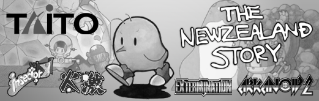</td>
 <td>jtshouse - Namco System I </td>
</tr>
<tr><th colspan="3">Other Multi Game Arcade Cores (from <a href="https://github.com/antongale">Anton Gale</a>, <a href="https://patreon.com/nullobject">nullobject</a>, <a href="https://github.com/Coin-OpCollection">Coin-Op Collection</a>)</th></tr>
<tr>
 <td>taitosj - Taito System SJ 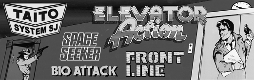</b></td>
 <td>tecmo - Tecmo Rygar Board </b></td>
 <td>toaplan2_c - Toaplan Version 2 (Combo*) 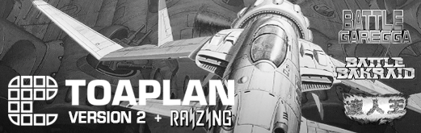</td>
</tr>
<tr><th colspan="3"><a href="https://patreon.com/jotego">Jotego</a> Single Game Arcade Cores</th></tr>
<tr>
 <td>jt1942 - 1942 </td>
 <td>jtbubl - Bubble Bobble </td>
 <td>jtbtiger - Black Tiger </td>
</tr>
<tr>
 <td>jtcastle - Haunted Castle </td>
 <td>jtcontra - Contra 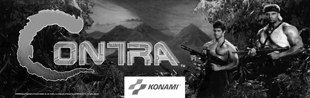</td>
 <td>jtcop - Robocop 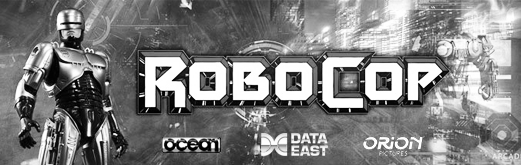</td>
</tr>
<tr>
 <td>jtcomsc - Combat School </td>
 <td>jtdd - Double Dragon 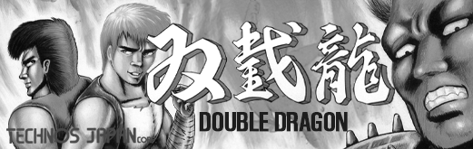</td>
 <td>jtdd2 - Double Dragon II 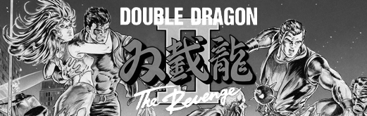</td>
</tr>
<tr>
 <td>jtexed - Exed Exes 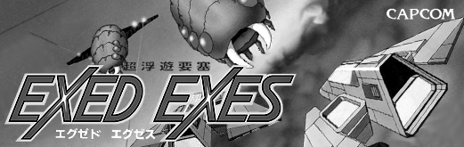</td>
 <td>jtfround - The Final Round 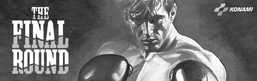</td>
 <td>jtgng - Ghosts 'n Goblins 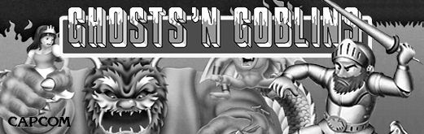</td>
</tr>
<tr>
 <td>jtgunsmk - Gunsmoke 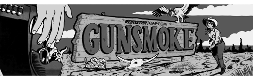</td>
 <td>jtkarnov - Karnov </td> 
 <td>jtkicker - Shao-Lin's Road 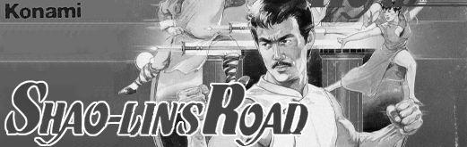</td>
</tr>
<tr>
 <td>jtkunio - Renegade Kunio-kun 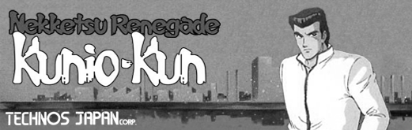</td>
 <td>jtmikie - Mikie 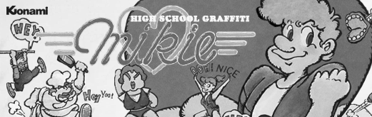</td>
 <td>jtninja - Bad Dudes v. Dragon Ninja 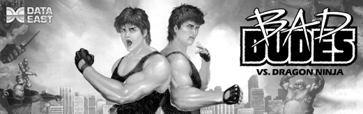</td>
</tr>
<tr>
 <td>jtoutrun - Outrun </td>
 <td>jtpang - Pang / Super Pang 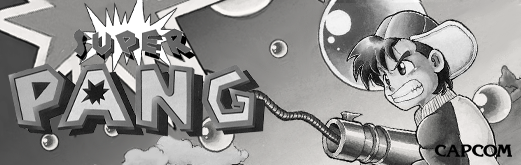</td>
 <td>jtpinpon - Konami's Ping Pong 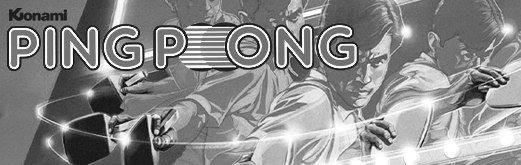</td>
</tr>
<tr>
 <td>jtrastan - Rastan 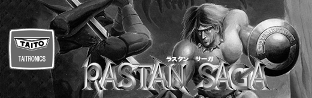</td>
 <td>jtroadf - Road Fighter 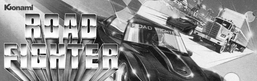</td>
 <td>jtroc - Roc'n Rope 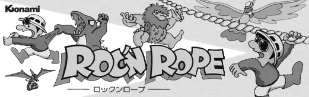</td>
</tr>
<tr>
 <td>jtsarms - Hyper Dyne Side Arms  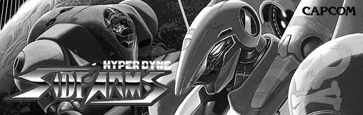</td>
 <td>jtsbaskt - Super Basketball 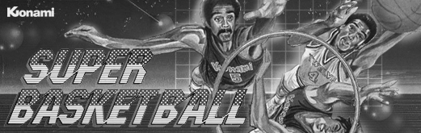</td>
 <td>jtsectnz - Section Z 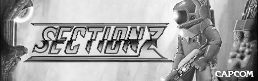</td>
</tr>
<tr>
 <td>jtsf - Street Fighter 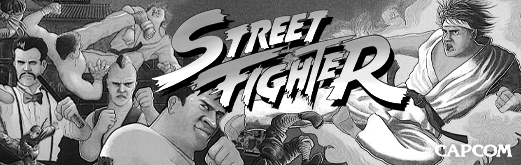</td>
 <td>jtshanon - Super Hang-On 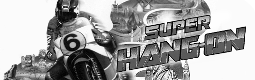</td>
 <td>jtsimson - The Simpsons 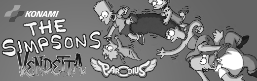</td>
</tr>
<tr>
 <td>jttora - Tiger Road 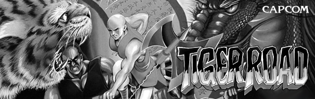</td>
 <td>jttmnt - Teenage Mutant Ninja Turtles 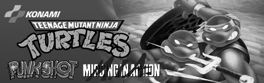</td>
 <td>jttrojan - Trojan 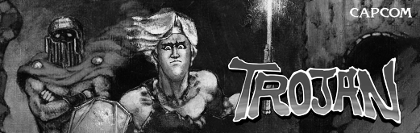</td>
</tr>
<tr>
 <td>jttrack - Track & Field 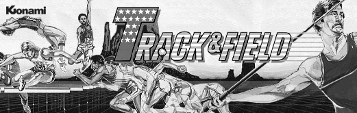</td>
 <td>jtvigil - Vigilante 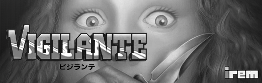</td>
 <td>jtyiear - Yie Ar Kung-Fu 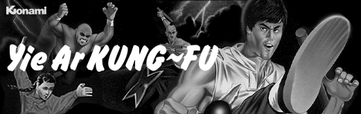</td>
</tr>
<tr><th colspan="3">CoinOpCollection Single Game Arcade Cores (from <a href="https://github.com/psomashekar">Pram0d</a>)</th></tr>
<tr>
 <td>bakraid - Battle Bakraid 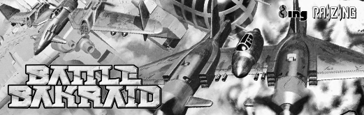</td>
 <td>batrider - Armed Police Batrider 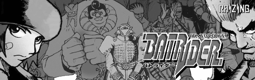</td> 
 <td>garegga - Battle Garegga 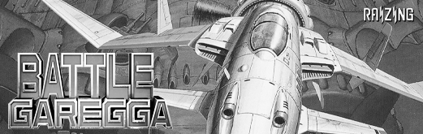</td>
</tr>
<tr>
 <td>kingdmgp - Kingdom Gran Prix 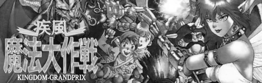</td>
 <td>sstriker - Sorcerer Striker 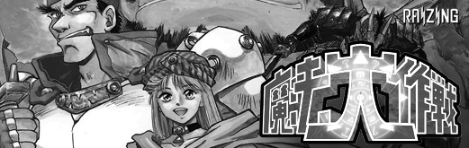</td>
 <td>snowbros2 - Snow Bros 2 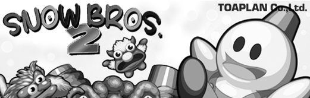</td>
</tr>
<tr><th colspan="3"><a href="https://patreon.com/atrac17">CoinOpCollection</a> Single Game Arcade Cores</th></tr>
<tr>
 <td>pipibibs - Whoopee! 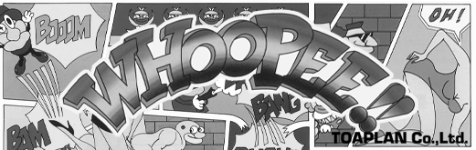</td>
 <td>truxton2 - Truxton II / Tatsujin Oh 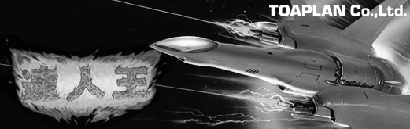</td>
</tr>
<tr><th colspan="3"><a href="https://github.com/opengateware">OpenGateware</a> Single Game Arcade Cores</th></tr>
<tr>
 <td>bankpanic - Bank Panic 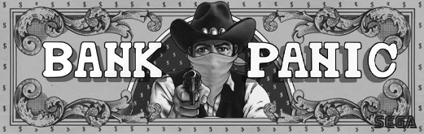</td>
 <td>congo - Congo Bongo 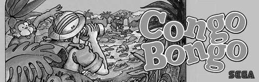</td>
 <td>digdug - Dig Dug 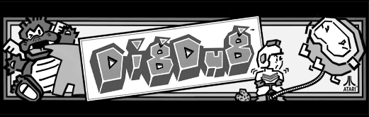</td>
</tr>
<tr>
 <td>galaga - Galaga 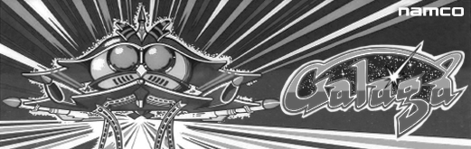</td>
 <td>gberet - Green Beret 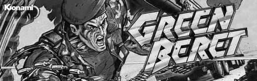</td>
 <td>pooyan - Pooyan 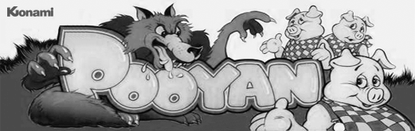</td>
</tr>
<tr>
 <td>xevious - Xevious 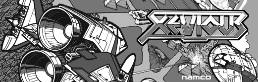</td>
</tr>
<tr><th colspan="3"><a href="https://github.com/ericlewis">ericlewis</a> Single Game Arcade Cores</th></tr>
<tr>
 <td>asteroids - Atari Asteroids 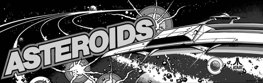</td>
 <td>dominos - Atari Dominos 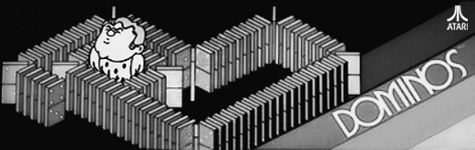</td>
 <td>donkeykong - Donkey Kong 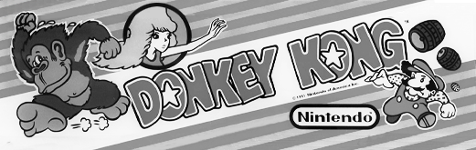</td>
</tr>
<tr>
 <td>lunarlander - Lunar Lander </td>
 <td>qbert - Q*Bert </td>
 <td>radarscope - Radar Scope </td>
</tr>
<tr>
 <td>spacerace - Space Race </td>
 <td>superbreakbout - Super Breakout </td>
</tr>
<tr><th colspan="3"><a href="https://github.com/antongale">Anton Gale</a> Single Game Arcade Cores</th></tr>
<tr>
 <td>slapfight - Slap Fight </td>
 <td>performan - Performan </td>
 <td>exerion - Exerion </td>
</tr>
<tr><th colspan="3">Single Core Games from <a href="https://github.com/agg23">agg23</a>, <a href="https://github.com/RndMnkIII">RndMnkIII</a></th></tr>
<tr>
 <td>alphamission - Armored-Scrum-Object </td>
 <td>pong - Atari Pong </td>
</tr>
</table>