## Platform Overrides for Home Cores

This is the main set of home images. There are four categories of "Home" cores: **Console**, **Handheld**, **Computer**, and **Others**

Because I grew up in the US, they all have an American bias. But, I have created extra sets of images for regional variants.

You can view those differences here: <b><a href="image_regional_variants.md">Regional Variants</a></b>

<table>
<tr><th colspan="3">Console Cores</th></tr>
<tr>
 <td>snes - Super Nintendo 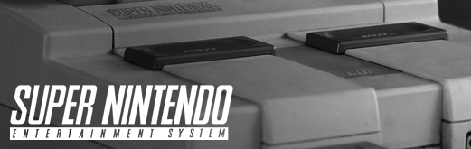</td>
 <td>nes - Nintendo NES 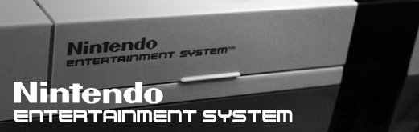</td>
 <td>ng - SNK Neo Geo </td>
</tr>
<tr>
 <td>genesis - Sega Genesis </td>
 <td>sms - Master System </td>
 <td>sg1000 - Sega SG-1000 </td>
</tr>
<tr>
 <td>pce - Turbo Grafx 16 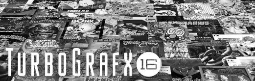</td>
 <td>pcecd - Turbo Grafx CD 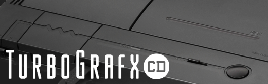</td>
 <td>coleco - Colecovision 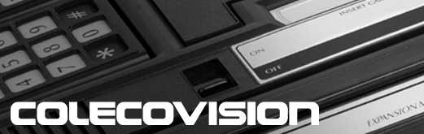</td>
</tr>
<tr>
 <td>7800 - Atari 7800 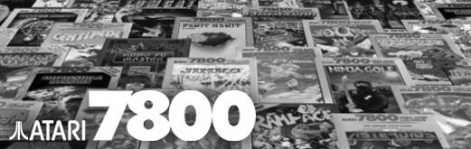</td>
 <td>5200 - Atari 5200 </td>
 <td>2600 - Atari 2600 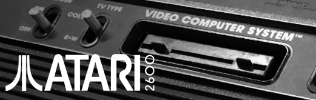</td>
</tr>
<tr>
 <td>intv - Intellivision 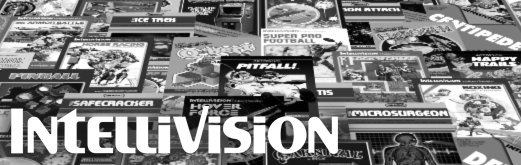</td>
 <td>odyssey2 - Odyssey 2 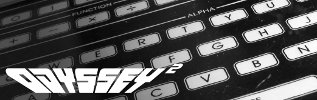</td>
 <td>channel_f - Channel-F </td>
</tr>
<tr>
 <td>arcadia - Arcadia 2001 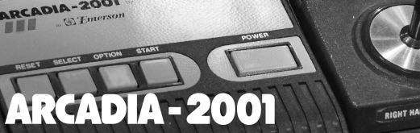</td>
 <td>creativision - Creativsion </td>
 <td>studio2 - RCA Studio II 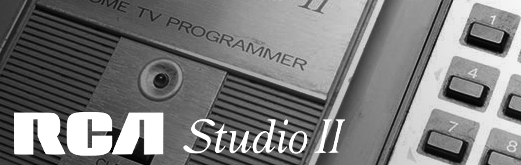</td>
</tr>
<tr><th colspan="3">Handheld Cores</th></tr>
<tr>
 <td>gba - GameBoy Advance </td>
 <td>gbc - GameBoy Color </td>
 <td>gb - GameBoy 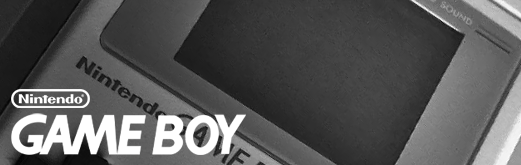</td>
</tr>
<tr>
 <td>supergb - Super GameBoy 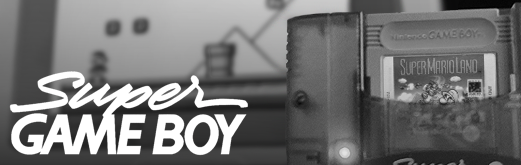</td>
 <td>gameandwatch - Game & Watch </td>
 <td>poke_mini - Pokemon Mini 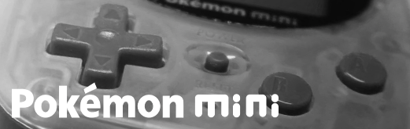</td>
</tr>
<tr>
 <td>wonderswan - WonderSwan Color </td>
 <td>jtngp - Neo Geo Pocket </td>
 <td>gg - Sega GameGear </td>
</tr>
<tr>
 <td>arduboy - Arduboy 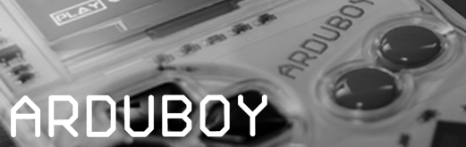</td>
 <td>supervision - Supervision </td>
 <td>megaduck - Mega Duck 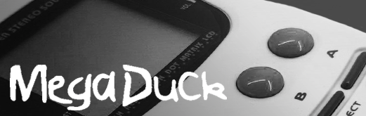</td>
</tr>
<tr>
 <td>game_king - GameKing 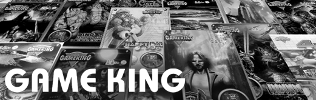</td>
 <td>gamate - Gamate </td>
 <td>avision - Adventure Vision </td>
</tr>
<tr>
 <td>tamagotchi_p1 - Tamagotchi </td>
</tr>
<tr><th colspan="3">Computer Cores</th></tr>
<tr>
 <td>Amiga 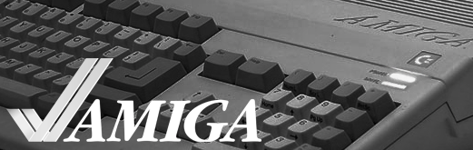</td>
 <td>videobrain - VideoBrain </td>
 <td>pdp1 - PDP-1 Spacewar </td>
</tr>
<tr><th colspan="3">Single Game / Application Cores</th></tr>
<tr>
 <td>mcc_minibreak - Minibreak 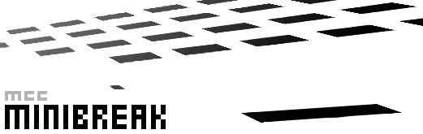</td>
<tr/>
<tr>
 <td>flappybird - Flappy Bird 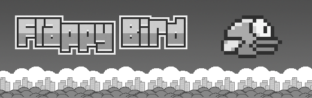</td>
 <td>life - Conway's Game of Life 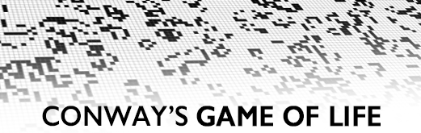</td>
</tr>
<tr><th colspan="3">Others / Experimental Cores</th></tr>
<tr>
 <td>riscv - Risc-V (dev) 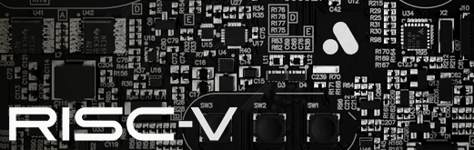</td>
 <td>spc_player - SPC Player (alpha) </td>
 <td>playstation - Playstation (alpha) 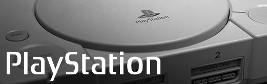</td>
</tr>
</table>