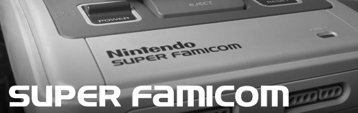
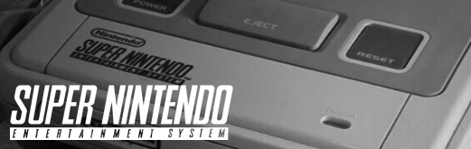
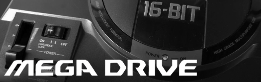
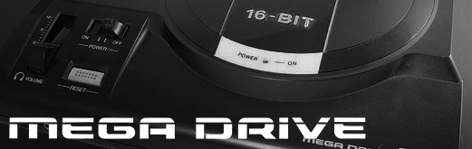

## Regional Variants for Home Cores

I grew up in the US, so my base set of images are from my own territory. I created some regional variants for those that grew up in other areas around the world.

<table>
<tr><th colspan="3">Console Cores</th></tr>
<tr>
 <td>North America</td>
 <td>Japan</td>
 <td>European / PAL</td>
</tr>
<tr>
 <td>snes - Super Nintendo </td>
 <td>snes - Super Famicom </td>
 <td>snes - Super Nintendo </td>
</tr>
<tr>
 <td>nes - Nintendo </td>
 <td>new - Famicom</td>
 <td>(same as NA)</td>
</tr>
<tr>
 <td>genesis - Sega Genesis </td>
 <td>genesis - Mega Drive </td>
 <td>genesis - Mega Drive </td>
</tr>
<tr>
 <td>sms - MasterSystem </td>
 <td>sms - Sega Mark III</td>
 <td>(same as NA)</td>
</tr>
<tr>
 <td>pce - Turbo Grafx 16 </td>
 <td>pce - PC Engine</td>
 <td>pce - PC Engine</td>
</tr>
<tr>
 <td>pcecd - Turbo Grafx CD </td>
 <td>pcecd - PC Engine CD</td>
 <td>pcecd - PC Engine CD</td> 
</tr>
</table>