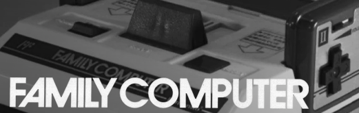
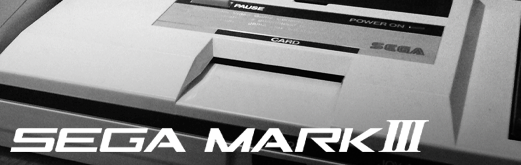

## Regional Variants for Home Cores

I grew up in the US, so my base set of images are from my own territory. I created some regional variants for those that grew up in other areas around the world.

To use these, download the corresponding zip from the latest release. The Zip file for these regional variants only includes these extra files and nothing else.

<table>
<tr>
 <th>
   North America 
   home.zip (all home images)
 </th>
 <th>
   Japan 
   home-jp-alt.zip (only these alts)
 </th>
 <th>
   European / PAL 
   home-pal-alt.zip (only these alts)
 </th>
</tr>
<tr>
 <td>snes - Super Nintendo </td>
 <td>snes - Super Famicom </td>
 <td>snes - Super Nintendo </td>
</tr>
<tr>
 <td>nes - Nintendo </td>
 <td>nes - Famicom </td>
 <td>(same as NA)</td>
</tr>
<tr>
 <td>genesis - Sega Genesis </td>
 <td>genesis - Mega Drive </td>
 <td>genesis - Mega Drive </td>
</tr>
<tr>
 <td>sms - MasterSystem </td>
 <td>sms - Sega Mark III </td>
 <td>(same as NA)</td>
</tr>
<tr>
 <td>pce - Turbo Grafx 16 </td>
 <td>pce - PC Engine</td>
 <td>pce - PC Engine</td>
</tr>
<tr>
 <td>pcecd - Turbo Grafx CD </td>
 <td>pcecd - PC Engine CD</td>
 <td>pcecd - PC Engine CD</td> 
</tr>
</table>